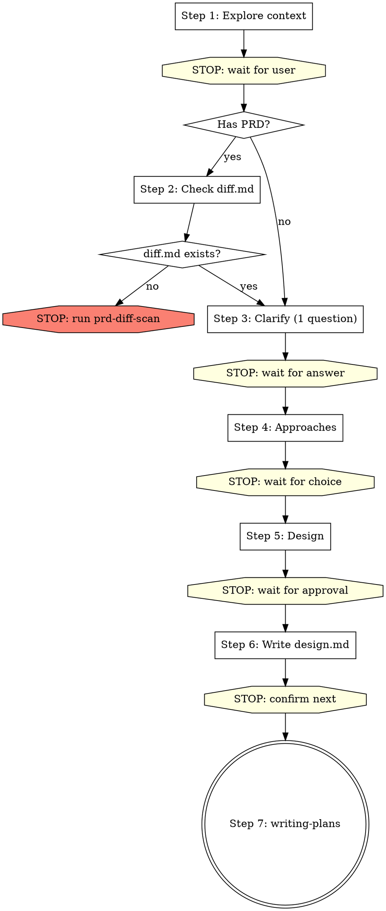

# Brainstorming Ideas Into Designs

## Overview

Help turn ideas into fully formed designs and specs through natural collaborative dialogue.

Start by understanding the current project context, then ask questions one at a time to refine the idea. Once you understand what you're building, present the design and get user approval.

If the user explicitly wants **详细设计** and the project has templates under `spec/`, use the matching template when you save the final document.

In a PRD/UI-driven development-design workflow, treat detailed design as the default written output for every in-scope side:
- Frontend is in scope when the input or diff mentions a UI project, page paths, prototypes/screenshots, page interactions, or frontend changes/blockers.
- Backend is in scope when the input or diff mentions APIs, controllers/services/mappers, database work, SAP/mock integration, or backend changes/blockers.
- If both sides are in scope and the user did not explicitly narrow scope, you MUST produce two detailed-design docs before any planning: one frontend doc and one backend doc.

## 自动测试 / 非交互模式（窄例外）

默认仍然是**一步一轮、逐轮确认**。

只有同时满足以下条件，才允许把多步串起来自动执行：

- 用户明确说这是自动测试、CI、批处理或非交互场景
- 用户明确说：没有 blocker 时，默认采用推荐方案
- 用户明确说：默认同意继续下一步、默认同意落盘

启用后可以这样做：

- 不必在 Step 3 / Step 4 / Step 5 / Step 6 之间逐轮停下
- 可以把用户的授权视为：已批准推荐方案、已批准继续、已批准保存文档
- 如果用户明确要详细设计，可以直接写并落盘 `*-detail-design.md`

但下面这些情况仍然**必须停**：

- diff 里还有未解决 blocker
- 关键业务规则不清
- 前后端模板所需信息明显不足
- 你需要用户拍板而不是推荐

<HARD-GATE>
Do NOT invoke any implementation skill, write any code, scaffold any project, or take any implementation action until you have presented a design and the user has approved it. This applies to EVERY project regardless of perceived simplicity.

Replies like `继续`, `下一步`, `往下走`, or answers to clarification questions do NOT count as design approval on their own. Outside explicit auto-test / non-interactive mode, you must still save the design docs, STOP, and wait for an explicit confirmation to enter `writing-plans`.
</HARD-GATE>

## Restrictions

- This skill can create `*-design.md` documents, and it may create `*-detail-design.md` when the user explicitly asks for detailed design
- Do NOT create: `*-diff.md`, `*-plan.md`, `*-db-design.md` — these belong to other skills
- **One step per turn**: complete one step, then STOP and wait for user to reply. Do NOT continue to the next step in the same turn.
- In explicit auto-test / non-interactive mode, you may combine steps after prerequisites are satisfied and no blockers remain.
- Do NOT do the diff scan yourself. If diff.md is missing, stop and tell the user.
- If both frontend and backend are in scope, Step 5 must present both sides and Step 6 must save two docs. Do NOT silently drop one side because it looks "already implemented".

---

## Steps (one step per turn — STOP after each step and wait for user)

You MUST create a task for each step and complete them in order.
**Each step = one conversation turn.** After completing a step, end your message and wait for user input.

---

### Step 1: Explore project context

- Check out the current project state (files, docs, recent commits)
- Understand what the user wants to build
- If `spec/index.md` exists, read it. If the user wants frontend/backend detailed design, also note the matching template path under `spec/`

**After completing exploration, end your turn.** Present a brief summary of what you found and ask the user one clarifying question.

In explicit auto-test / non-interactive mode, if the user already supplied the needed defaults and there are no blockers, you may continue without stopping.

---

### Step 2: Check PRD diff scan prerequisite

If no PRD / prototype / requirement doc was provided → skip to Step 3.

If user provided PRD or requirement doc:

1. Use Glob to check if `docs/plans/*-diff.md` exists
2. If exists → Read the diff document, note any unresolved Blockers, then proceed to Step 3
3. If NOT exists → **STOP. End your turn immediately.** Output only this:

> ❌ 差异扫描文档不存在。请先单独执行 `prd-diff-scan` skill 完成差异扫描：
> `Skill("superpowers:prd-diff-scan")`
> 差异扫描完成后再执行 brainstorming。

Do NOT create the diff document yourself. Do NOT continue. End your turn.

---

### Step 3: Ask clarifying questions

- One question at a time — do NOT ask multiple questions in one message
- If diff scan has unresolved Blockers, resolve them here before proceeding
- Focus on: purpose, constraints, success criteria, business rules

**Ask ONE question, then STOP and wait for user reply.** Repeat Step 3 until all questions are answered. Then proceed to Step 4 in the NEXT turn.

In explicit auto-test / non-interactive mode, if the user already pre-approved the recommended defaults and no blockers remain, you may resolve Step 3 without stopping.

---

### Step 4: Propose 2-3 approaches

- Present 2-3 different approaches with trade-offs
- Lead with your recommended option and explain why

**After presenting approaches, STOP and wait for user to choose.** Do NOT proceed to Step 5 in the same turn.

In explicit auto-test / non-interactive mode, you may proceed with your recommended option if the user pre-approved that behavior.

---

### Step 5: Present design

- Scale each section to its complexity
- Cover: architecture, components, data flow, error handling, testing
- If this is a detailed-design request, align the sections with the matching template under `spec/`
- If both frontend and backend are in scope, present them as two separate sections/documents-to-be-written, not as one blended summary
- Ask after each section whether it looks right so far

**After presenting each section, STOP and wait for user feedback.** Only after user approves all sections, output:

In explicit auto-test / non-interactive mode, you may treat the user's pre-approval as approval for all sections unless a blocker appears.

→ **CHECKPOINT**: "✅ 用户已确认设计：`[一句话总结]`。"

---

### Step 6: Write design doc

- If this is a normal design, save it to `docs/plans/YYYY-MM-DD-<topic>-design.md`
- Determine scope before writing:
  - Frontend in scope → use `spec/frontend/vue/detail-design-template.md` and save `docs/plans/YYYY-MM-DD-<topic>-frontend-detail-design.md`
  - Backend in scope → use `spec/backend/java/detail-design-template.md` and save `docs/plans/YYYY-MM-DD-<topic>-backend-detail-design.md`
- If both frontend and backend are in scope, you MUST write both detailed-design docs before ending the turn
- If one side is intentionally out of scope, say so explicitly before writing and record that decision in the saved design output
- Design docs must be written to disk. Do NOT leave them only in chat.
- Do NOT create plan.md, db-design.md, or diff.md here.
- Commit the design document to git

→ **CHECKPOINT**: "✅ 设计文档已保存到 `[路径]`。可以进入实施计划。"

**After saving, STOP.** Ask user: "设计文档已保存。是否现在进入实施计划（writing-plans）？"

Do NOT create `*-plan.md`, invoke `writing-plans`, or start coding in the same turn unless this is explicit auto-test / non-interactive mode with prior user approval to continue automatically.

In explicit auto-test / non-interactive mode, you may stop immediately after saving and report the saved paths.

---

### Step 7: Transition to implementation

Only after user explicitly confirms the saved design docs are approved → invoke the writing-plans skill.
If the user only says `继续` / `下一步`, treat that as permission to continue the current discussion, not as permission to create a plan or start implementation.
Do NOT invoke any other skill. writing-plans is the ONLY next step.

---

## Process Flow

## Key Principles

- **One step per turn** - Complete one step, stop, wait for user
- **One question at a time** - Don't overwhelm with multiple questions
- **Multiple choice preferred** - Easier to answer than open-ended when possible
- **YAGNI ruthlessly** - Remove unnecessary features from all designs
- **Explore alternatives** - Always propose 2-3 approaches before settling
- **Blockers first** - If diff scan found blockers, resolve them before proposing approaches
