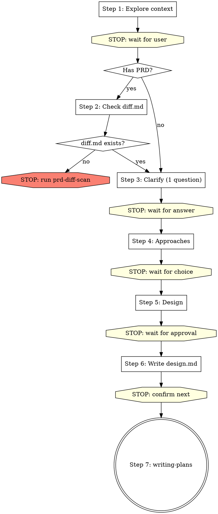

# Brainstorming Ideas Into Designs

## Overview

Help turn ideas into fully formed designs and specs through natural collaborative dialogue.

Start by understanding the current project context, then ask questions one at a time to refine the idea. Once you understand what you're building, present the design and get user approval.

If the user explicitly wants **详细设计** and the project has templates under `spec/`, use the matching template when you save the final document.

In a PRD/UI-driven development-design workflow, treat detailed design as the default written output for every in-scope side:
- Frontend is in scope when the input or diff mentions a UI project, page paths, page interactions, or frontend changes/blockers.
- Backend is in scope when the input or diff mentions APIs, controllers/services/mappers, database work, SAP/mock integration, or backend changes/blockers.
- If both sides are in scope and the user did not explicitly narrow scope, you MUST produce two detailed-design docs before any planning: **先写前端，再基于前端文档写后端**。

<HARD-GATE>
Do NOT invoke any implementation skill, write any code, scaffold any project, or take any implementation action until you have presented a design and the user has approved it. This applies to EVERY project regardless of perceived simplicity.

Replies like `继续`, `下一步`, `往下走`, or answers to clarification questions do NOT count as design approval on their own. You must save the design docs, STOP, and wait for an explicit confirmation to enter `writing-plans`.
</HARD-GATE>

## Restrictions

- This skill can create `*-design.md` documents, and it may create `*-detail-design.md` when the user explicitly asks for detailed design
- Do NOT create: `*-diff.md`, `*-plan.md`, `*-db-design.md` — these belong to other skills
- **One step per turn**: complete one step, then STOP and wait for user to reply. Do NOT continue to the next step in the same turn.
- Do NOT do the diff scan yourself. If diff.md is missing, stop and tell the user.
- If both frontend and backend are in scope, Step 5 must present both sides (先前端后后端) and Step 6 must save two docs (先前端，再基于前端写后端). Do NOT silently drop one side because it looks "already implemented".

---

## Steps (one step per turn — STOP after each step and wait for user)

You MUST create a task for each step and complete them in order.
**Each step = one conversation turn.** After completing a step, end your message and wait for user input.

---

### Step 1: Explore project context

- Check out the current project state (files, docs, recent commits)
- Understand what the user wants to build
- If `spec/index.md` exists, read it. If the user wants frontend/backend detailed design, also note the matching template path under `spec/`

**After completing exploration, end your turn.** Present a brief summary of what you found and ask the user one clarifying question.

---

### Step 2: Check PRD diff scan prerequisite

If no PRD / requirement doc was provided → skip to Step 3.

If user provided PRD or requirement doc:

1. Use Glob to check if `docs/plans/*/diff.md` exists
2. If exists → Read the diff document, then **验证完整性与新鲜度**：
   - 如果 diff 文档有 Git 基线（`Git 仓库根目录 != 无`），检查 commit 是否一致：执行 `git -C <原型目录> log -1 --format="%H"`，与 diff 文档的 `当前原型 Commit ID` 比对。不一致 → **STOP**，告知用户重新执行 `prd-diff-scan`
   - 每个 PRD 页面是否都有 5 维度对比（UI 可视要素 + 控件矩阵 + 字段对比 + 9 维度 + 验收点）
   - 差异清单 Dx 是否覆盖了对比表中所有「差异」行
   - 建议决议是否逐项覆盖了所有 Dx 和 Bx
   - 如果不完整或已过期 → **STOP**，告知用户重新执行 `prd-diff-scan`
   - 如果完整 → 提取差异决议表中所有「⏳ 待确认」项，告知用户"Step 3 将逐项确认这 N 项差异和 Blockers"
3. If NOT exists → **STOP. End your turn immediately.** Output only this:

> ❌ 差异扫描文档不存在。请先单独执行 `prd-diff-scan` skill 完成差异扫描：
> `Skill("superpowers:prd-diff-scan")`
> 差异扫描完成后再执行 brainstorming。

Do NOT create the diff document yourself. Do NOT continue. End your turn.

---

### Step 3: 逐项确认差异决议 + 需求澄清

当存在 diff 文档时，Step 3 的**首要任务**是逐项确认差异决议表中所有「⏳ 待确认」的 Dx 和 Bx。**全部确认完毕之前，不得进入 Step 4。**

#### 3a. 逐项确认差异决议（diff 文档存在时必做）

每轮展示**一批**待确认项（建议 3-5 项/批），格式如下：

```
以下差异项需要您确认（第 X/Y 批，共 N 项待确认）：

| 编号 | 差异/问题摘要 | 建议处理方案 | 您的决定 |
|------|-------------|-------------|---------|
| D1 | [摘要] | [建议方案] | ⏳ 请确认 |
| D2 | [摘要] | [建议方案] | ⏳ 请确认 |
| D3 | [摘要] | [建议方案] | ⏳ 请确认 |

请逐项确认：同意建议 / 选择其他方案 / 有疑问需讨论。
```

流程：
- 用户回复后，记录每项的用户决定
- **STOP，等待用户回复**
- 展示下一批待确认项
- **重复直到所有 Dx 和 Bx 都已确认**
- 全部确认后，用 Edit 工具更新 diff 文档的差异决议表（将「⏳ 待确认」改为「✅ + 用户选择的方案」），并输出确认完成的 checkpoint：

> **CHECKPOINT**: "✅ 差异决议已全部确认（Dx __ 项 + Bx __ 项 = __ 项），diff 文档已更新。"

#### 3b. 其他澄清问题（差异全部确认后）

差异决议全部确认后，如果还有其他需要澄清的问题：
- One question at a time — do NOT ask multiple questions in one message
- Focus on: purpose, constraints, success criteria, business rules

**Ask ONE question, then STOP and wait for user reply.** Repeat until all questions answered.

#### Step 3 → Step 4 门禁

**以下条件全部满足后才能进入 Step 4：**
1. diff 文档的差异决议表中所有 Dx 和 Bx 都已标记 ✅（用户已逐项确认）
2. diff 文档已更新落盘
3. 没有剩余的澄清问题

如果任一条件不满足，继续 Step 3。不得跳过未确认的差异项。

---

### Step 4: Propose 2-3 approaches

- Present 2-3 different approaches with trade-offs
- Lead with your recommended option and explain why

**After presenting approaches, output the following then STOP：**

→ "请选择方案（A / B / C），或提出其他想法。"

<HARD-STOP>
**Do NOT proceed to Step 5 in the same turn.**
This is the most commonly violated gate. After presenting approaches, you MUST end your turn and wait for the user to explicitly choose an approach.
Even if you think the choice is obvious, STOP and wait.
</HARD-STOP>

#### Step 4 → Step 5 门禁

**以下条件全部满足后才能进入 Step 5：**
1. 用户已明确选择了一个方案（如"方案A"、"推荐方案"、"第一个"）
2. 方案选择发生在**用户的回复中**，不是你自己推断的

如果用户只说"继续"/"下一步"而没有选方案，追问"请先选择方案 A / B / C"。不得默认采用推荐方案。

---

### Step 5: Present design

- Scale each section to its complexity
- Cover: architecture, components, data flow, error handling, testing
- If this is a detailed-design request, align the sections with the matching template under `spec/`
- If both frontend and backend are in scope, **先展示前端设计，再展示后端设计**；后端设计的接口清单必须对齐前端控件矩阵中的「调用接口」列
- Ask after each section whether it looks right so far

**After presenting each section, STOP and wait for user feedback.** Only after user approves all sections, output:

→ **CHECKPOINT**: "✅ 用户已确认设计：`[一句话总结]`。"

---

### Step 6: Write design doc (per-page directory structure)

Design documents are organized by **page** inside a **task directory**:

```
docs/plans/YYYY-MM-DD-<topic>/           # 任务根目录（由 prd-diff-scan 创建）
  index.md                               # 主索引（本步骤创建）
  diff.md                                # 已存在
  <page-slug>/                           # 页面子目录
    frontend-detail-design.md
    backend-detail-design.md
```

#### 6.0 确定任务根目录和页面清单

1. **任务根目录**：从已有的 `diff.md` 所在目录推断。如果不存在 diff.md（无 PRD 场景），则创建 `docs/plans/YYYY-MM-DD-<topic>/`。
2. **页面清单**：从 diff 文档的受影响页面清单或用户提供的需求中提取。每个页面对应一个 kebab-case 的子目录名（page-slug）。

#### 6.1 按页面保存设计文件（每页一轮，逐页推进）

**上下文管理**：当写到第 4 个页面且前后端都有时（≥ 8 份文档），主动建议用户在新对话中继续，避免输出截断。

- Determine scope before writing:
  - Frontend in scope → use `spec/frontend/vue/detail-design-template.md`
  - Backend in scope → use `spec/backend/java/detail-design-template.md`

**每轮只处理一个页面。** 对当前页面：

**Step 6a：前端详细设计**（Frontend in scope 时执行）
1. 创建页面子目录
2. 按模板写入并保存 `<task>/<page-slug>/frontend-detail-design.md`
3. **保存前必须通过模板 Section 10 自检清单**（18 项全部 ✅ 才可保存）

**Step 6b：后端详细设计**（Backend in scope 时执行，必须在 6a 之后）
4. 写入并保存 `<task>/<page-slug>/backend-detail-design.md`
5. **保存前必须通过模板头部自检清单**（14 项全部 ✅ 才可保存）
6. 后端文档必须在「需求输入」中引用同目录下的前端详细设计路径

**页面完成**
7. 输出 checkpoint：`"✅ 页面 <page-slug> 设计已保存（第 X / 共 Y 个页面）"`
8. **如果还有更多页面 → STOP，等用户确认后继续下一个页面**
9. **如果是最后一个页面 → 继续到 6.2 创建 index.md**

> Step 6 会跨越多个对话轮次（每个页面一轮）。

#### 前后端写入顺序与对齐规则

依赖链：`原型图/PRD → 前端详细设计 → 后端详细设计`

1. **先写前端**：字段必须逐项对照 `diff.md` 中 PRD 字段对比表（前端是原型的唯一翻译层）
2. **再写后端**：后端只对齐前端、不再独立对照原型。后端文档必须：
   - 接口清单覆盖前端控件矩阵中所有「调用接口」
   - 请求参数/返回结构与前端类型设计保持一致
   - 前端控件矩阵出现的接口场景，后端也必须覆盖

#### 文档独立性规则

每份设计文档**必须独立可读、独立可执行**。

**禁止跨页面引用**：不得写"同 xxx 页面"、"参见 ../other-page/..."。

**相似页面**的正确做法：复制完整内容 → 删除不需要的部分 → 修改特有部分。最终文档是完整、自包含的。

**后端自包含**：跨页面共享的实体/DB 表/公共 API 设计在每个用到它的页面中**重复包含**，不创建 shared 文件。

#### 6.2 创建 index.md

所有页面的设计文件保存完毕后，在任务根目录创建 `index.md`：

```markdown
# <功能名称> — 实施索引

## 元信息

- **创建日期**: YYYY-MM-DD
- **PRD**: `<prd路径>`
- **任务根目录**: `docs/plans/YYYY-MM-DD-<topic>/`
- **技术栈**: [如 Vue 3 + Spring Boot + MySQL]

## 页面清单

| 页面 Slug | 页面名称 | 前端设计 | 后端设计 | Plan | 设计状态 | 实施状态 |
|-----------|---------|---------|---------|------|---------|---------|
| <page-slug> | <页面名> | [link](./<page-slug>/frontend-detail-design.md) | [link](./<page-slug>/backend-detail-design.md) | — | 已完成 | 未开始 |

## 页面-API 映射

| 页面 | API 路径 | Method | Controller | 是否共享 |
|------|---------|--------|------------|---------|
| <page-slug> | /api/path | GET/POST | XxxController | 是/否 |
```

说明：
- `Plan` 列此时为 `—`，由 writing-plans 填充
- `设计状态` 标记为 `已完成`
- `实施状态` 标记为 `未开始`
- 页面-API 映射从各页面的后端设计接口清单中提取
- **去重检查**：页面清单中每个 page-slug 只能出现一次。保存前逐行扫描，发现重复行必须删除

- Do NOT create plan.md, db-design.md, or diff.md here.
- Commit the design documents to git

→ **CHECKPOINT**: "✅ 全部 Y 个页面的设计文档已保存到 `docs/plans/YYYY-MM-DD-<topic>/` 目录，index.md 已创建。"

**After saving index.md, STOP.** Ask user: "设计文档已保存。是否现在进入实施计划（writing-plans）？"

Do NOT create `*-plan.md`, invoke `writing-plans`, or start coding in the same turn.

---

### Step 7: Transition to implementation

Only after user explicitly confirms the saved design docs are approved → invoke the writing-plans skill.
If the user only says `继续` / `下一步`, treat that as permission to continue the current discussion, not as permission to create a plan or start implementation.
Do NOT invoke any other skill. writing-plans is the ONLY next step.

---

## Process Flow



## Key Principles

- **One step per turn** - Complete one step, stop, wait for user
- **One question at a time** - Don't overwhelm with multiple questions
- **Multiple choice preferred** - Easier to answer than open-ended when possible
- **YAGNI ruthlessly** - Remove unnecessary features from all designs
- **Explore alternatives** - Always propose 2-3 approaches before settling
- **Blockers first** - If diff scan found blockers, resolve them before proposing approaches
