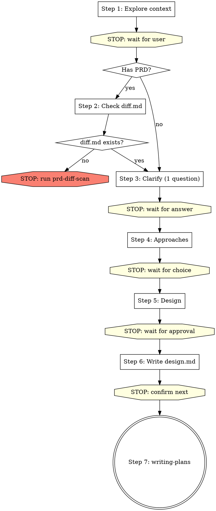

# Brainstorming Ideas Into Designs

## Overview

Help turn ideas into fully formed designs and specs through natural collaborative dialogue.

Start by understanding the current project context, then ask questions one at a time to refine the idea. Once you understand what you're building, present the design and get user approval.

If the user explicitly wants **详细设计** and the project has templates under `spec/`, use the matching template when you save the final document.

In a PRD/UI-driven development-design workflow, treat detailed design as the default written output for every in-scope side:
- Frontend is in scope when the input or diff mentions a UI project, page paths, page interactions, or frontend changes/blockers.
- Backend is in scope when the input or diff mentions APIs, controllers/services/mappers, database work, SAP/mock integration, or backend changes/blockers.
- If both sides are in scope and the user did not explicitly narrow scope, you MUST produce two detailed-design docs before any planning: **每个页面先写前端再写后端**（禁止先写完所有页面的前端设计再写后端设计）。执行模式（串行/并行）在 Step 6.0 由用户选择。

<HARD-GATE>
Do NOT invoke any implementation skill, write any code, scaffold any project, or take any implementation action until you have presented a design and the user has approved it. This applies to EVERY project regardless of perceived simplicity.

Replies like `继续`, `下一步`, `往下走`, or answers to clarification questions do NOT count as design approval on their own. You must save the design docs, STOP, and wait for an explicit confirmation to enter `writing-plans`.
</HARD-GATE>

## Restrictions

- In `6.1-parallel`, never declare success, create `index.md`, or say "all pages complete" based only on subagent replies. Success requires an on-disk verification pass against the full expected page list and all required frontend/backend design files.

- This skill can create `*-design.md` documents, and it may create `*-detail-design.md` when the user explicitly asks for detailed design
- Do NOT create: `diff.md`, `*-plan.md`, `*-db-design.md` — these belong to other skills
- **One step per turn**: complete one step, then STOP and wait for user to reply. Do NOT continue to the next step in the same turn.
- Do NOT do the diff scan yourself. If no valid `diff.md` exists in a current version directory, stop and tell the user.
- If both frontend and backend are in scope, Step 5 must present both sides (先前端后后端) and Step 6 must save two docs per page (先前端，再基于前端写后端). Do NOT silently drop one side because it looks "already implemented". Do NOT batch all frontend docs first then all backend docs — each page must complete both sides before moving on. 用户可在 Step 6.0 选择串行或并行模式。

---

## Steps (one step per turn — STOP after each step and wait for user)

You MUST create a task for each step and complete them in order.
**Each step = one conversation turn.** After completing a step, end your message and wait for user input.

---

### Step 1: Explore project context

- Check out the current project state (files, docs, recent commits)
- Understand what the user wants to build
- **并行执行以下探索**（在同一轮中同时发起）：
  - Read `spec/CODING_STANDARDS.md`，提取项目信息、技术栈、模块架构、前后端代码规范、可直接使用的基类/继承约定
  - 如果用户需要前端/后端详细设计，记录 `spec/` 下对应模板路径
- **禁止**扫描 `src/views/`、`src/api/`、`src/types/api/` 等项目代码来推断技术栈、架构、代码规范、接口约定或类型约定

**After completing exploration, end your turn.** Present a brief summary of what you found and ask the user one clarifying question.

---

### Step 2: Check PRD diff scan prerequisite

If no PRD / requirement doc was provided → skip to Step 3.

If user provided PRD or requirement doc:

1. **确定当前版本目录路径**（不得使用 `docs/plans/**/diff.md` glob 扫描）：
   - 如果用户明确给出了 diff 文件路径 → 直接使用该路径的所在目录
   - 如果用户给出了任务目录（如 `docs/plans/2026-03-19-xxx/`）→ 列出其子目录，找到最新的 commit 版本目录
   - 如果存在多个候选版本目录且无法唯一确定 → **STOP**，用 `AskUserQuestion` 让用户选择
   - 确定后记录：`当前版本目录 = <确切路径>`
2. 用 Read 工具直接读取 `<当前版本目录>/diff.md`
3. If not found → **STOP**，告知用户必须先重新执行 `prd-diff-scan` 生成当前版本目录中的 `diff.md`
4. If exists → **验证 diff 文档身份**：确认文档标题、PRD 路径与当前任务一致。然后**并行执行**：Bash `git -C <原型目录> log -1 --format="%H"` 获取当前 commit。**验证完整性与新鲜度**：
   - 如果 diff 文档有 Git 基线（`Git 仓库根目录 != 无`），比对当前 commit 与 diff 文档的 `当前原型 Commit ID`。不一致 → **STOP**，告知用户重新执行 `prd-diff-scan`
   - 每个 PRD 页面是否都有 5 维度对比（UI 可视要素 + 控件矩阵 + 字段对比 + 9 维度 + 验收点）
   - 差异清单 Dx 是否覆盖了对比表中所有「差异」行
   - 建议决议是否逐项覆盖了所有 Dx 和 Bx
   - 文档中是否不存在 `待核对` / `需核对` / `待读取` / `未读取源码` 等未完成标记
   - 如果不完整或已过期 → **STOP**，告知用户重新执行 `prd-diff-scan`
   - 如果完整 → 提取差异决议表中所有「⏳ 待确认」项，告知用户"Step 3 将逐项确认这 N 项差异和 Blockers"
4. If NOT exists → **STOP. End your turn immediately.** Output only this:

> ❌ 差异扫描文档不存在。请先单独执行 `prd-diff-scan` skill 完成差异扫描：
> `Skill("superpowers:prd-diff-scan")`
> 差异扫描完成后再执行 brainstorming。

Do NOT create the diff document yourself. Do NOT continue. End your turn.

---

### Step 3: 逐项确认差异决议 + 需求澄清

当存在 diff 文档时，Step 3 的**首要任务**是逐项确认差异决议表中所有「⏳ 待确认」的 Dx 和 Bx。**全部确认完毕之前，不得进入 Step 4。**

#### 3a. 逐项确认差异决议（diff 文档存在时必做）

每轮展示**一批**待确认项（建议 3-5 项/批），格式如下：

```
以下差异项需要您确认（第 X/Y 批，共 N 项待确认）：

| 编号 | 差异/问题摘要 | 建议处理方案 | 您的决定 |
|------|-------------|-------------|---------|
| D1 | [摘要] | [建议方案] | ⏳ 请确认 |
| D2 | [摘要] | [建议方案] | ⏳ 请确认 |
| D3 | [摘要] | [建议方案] | ⏳ 请确认 |

请逐项确认：同意建议 / 选择其他方案 / 有疑问需讨论。
```

流程：
- 用户回复后，记录每项的用户决定
- **STOP，等待用户回复**
- 展示下一批待确认项
- **重复直到所有 Dx 和 Bx 都已确认**
- 全部确认后，用 Edit 工具更新 diff 文档的差异决议表（将「⏳ 待确认」改为「✅ + 用户选择的方案」），并输出确认完成的 checkpoint：

> **CHECKPOINT**: "✅ 差异决议已全部确认（Dx __ 项 + Bx __ 项 = __ 项），diff 文档已更新。"

#### 3b. 其他澄清问题（差异全部确认后）

差异决议全部确认后，如果还有其他需要澄清的问题：
- One question at a time — do NOT ask multiple questions in one message
- Focus on: purpose, constraints, success criteria, business rules

**Ask ONE question, then STOP and wait for user reply.** Repeat until all questions answered.

#### Step 3 → Step 4 门禁

**以下条件全部满足后才能进入 Step 4：**
1. diff 文档的差异决议表中所有 Dx 和 Bx 都已标记 ✅（用户已逐项确认）
2. diff 文档已更新落盘
3. 没有剩余的澄清问题

如果任一条件不满足，继续 Step 3。不得跳过未确认的差异项。

---

### Step 4: Propose 2-3 approaches

- Present 2-3 different approaches with trade-offs
- Lead with your recommended option and explain why

**After presenting approaches, output the following then STOP：**

→ "请选择方案（A / B / C），或提出其他想法。"

<HARD-STOP>
**Do NOT proceed to Step 5 in the same turn.**
This is the most commonly violated gate. After presenting approaches, you MUST end your turn and wait for the user to explicitly choose an approach.
Even if you think the choice is obvious, STOP and wait.
</HARD-STOP>

#### Step 4 → Step 5 门禁

**以下条件全部满足后才能进入 Step 5：**
1. 用户已明确选择了一个方案（如"方案A"、"推荐方案"、"第一个"）
2. 方案选择发生在**用户的回复中**，不是你自己推断的

如果用户只说"继续"/"下一步"而没有选方案，追问"请先选择方案 A / B / C"。不得默认采用推荐方案。

---

### Step 5: Present design

- Scale each section to its complexity
- Cover: architecture, components, data flow, error handling, testing
- If this is a detailed-design request, align the sections with the matching template under `spec/`
- If both frontend and backend are in scope, **先展示前端设计，再展示后端设计**；后端设计的接口清单必须对齐前端控件矩阵中的「调用接口」列
- Ask after each section whether it looks right so far

**After presenting each section, STOP and wait for user feedback.** Only after user approves all sections, output:

→ **CHECKPOINT**: "✅ 用户已确认设计：`[一句话总结]`。"

---

### Step 6: Write design doc (per-page directory structure)

Design documents are organized by **page** inside a **version directory**.  
任务目录与版本目录的关系：
- **任务目录**：`docs/plans/YYYY-MM-DD-<topic>/`
- **版本目录**：有 commit 时为 `docs/plans/YYYY-MM-DD-<topic>/<commitid>/`；无 commit 时退化为任务目录本身

```
docs/plans/YYYY-MM-DD-<topic>/           # 任务目录
  <commitid>/                            # 版本目录（修改场景 / 有 commit 时）
    index.md                             # 主索引（本步骤创建）
    diff.md                              # 已存在
    <page-slug>/                         # 页面子目录
      frontend-detail-design.md
      backend-detail-design.md
```

#### 6.0 确定任务根目录和页面清单

**Page baseline hard gate**:
- Record the full page list as `EXPECTED_PAGES` from the current diff or explicit user requirement.
- Treat `EXPECTED_PAGES` as the only completion baseline for Step 6.
- Every later checkpoint, verification table, and `index.md` page row must cover every page in `EXPECTED_PAGES`; never infer the list from whichever files happen to exist.

1. **版本目录**：使用 Step 2 已确定的 `当前版本目录` 路径。如果不存在当前 diff 文档（无 PRD 场景），则创建 `docs/plans/YYYY-MM-DD-<topic>/`，并在有 commit 时继续创建 `docs/plans/YYYY-MM-DD-<topic>/<commitid>/` 作为版本目录。**不得使用 glob 重新扫描**。
2. **页面清单**：从当前 diff 文档的受影响页面清单或用户提供的需求中提取。每个页面对应一个 kebab-case 的子目录名（page-slug）。
3. **项目级事实来源**：详细设计阶段只允许从 `spec/CODING_STANDARDS.md` 获取技术栈、架构、代码规范和基类/继承约定，禁止扫描项目代码补充这些信息。
4. **选择执行模式**（页面数量 > 1 时）：

**必须使用 `AskUserQuestion` 工具**向用户提供选择（禁止仅输出文字后继续，必须调用工具等待用户回答）：

- 问题：`共 Y 个页面需要编写详细设计。请选择执行模式：`
- 选项 A：**串行模式** — 逐页推进，每页一轮对话，可逐页审阅反馈
- 选项 B：**并行模式** — 使用子代理同时编写所有页面，速度更快，完成后统一审阅
- 在问题描述中列出所有 page-slug

用户选择后进入对应的 6.1 或 6.1-parallel。页面数量 = 1 时直接进入 6.1，不询问。

#### 6.1 串行模式：按页面保存设计文件（每页一轮，逐页推进）

**上下文管理**：当写到第 4 个页面且前后端都有时（≥ 8 份文档），主动建议用户在新对话中继续，避免输出截断。也可建议用户切换到并行模式。

- Determine scope before writing:
  - Frontend in scope → use `spec/frontend/vue/detail-design-template.md`
  - Backend in scope → use `spec/backend/java/detail-design-template.md`

**每轮只处理一个页面。** 对当前页面：

**Step 6a：前端详细设计**（Frontend in scope 时执行）
1. **读取统一规范输入**：以前置步骤已读取的 `spec/CODING_STANDARDS.md` 作为项目级唯一规范来源，并结合当前 diff 文档和模板编写前端详细设计。只有在主代理已显式提供 PRD/原型的**确切绝对路径**，且确实需要核对字段/控件/权限细节时，才允许读取 PRD/原型；**禁止**子代理自行搜索 PRD/原型文件
2. 创建页面子目录
3. 按模板写入并保存 `<version-root>/<page-slug>/frontend-detail-design.md`
4. **保存前必须通过模板 Section 10 自检清单**（18 项全部 ✅ 才可保存）

**Step 6b：后端详细设计**（Backend in scope 时执行，必须在 6a 之后）
5. 写入并保存 `<version-root>/<page-slug>/backend-detail-design.md`
6. **保存前必须通过模板头部自检清单**（12 项全部 ✅ 才可保存）
7. 后端文档必须在「需求输入」中引用同目录下的前端详细设计路径

**页面完成**
7. 输出 checkpoint：`"✅ 页面 <page-slug> 设计已保存（第 X / 共 Y 个页面）"`
8. **如果还有更多页面 → STOP，等用户确认后继续下一个页面**
9. **如果是最后一个页面 → 继续到 6.2 创建 index.md**

> Step 6 串行模式会跨越多个对话轮次（每个页面一轮）。

#### 6.1-parallel 并行模式：子代理同时编写所有页面

用户选择并行模式后，使用 Agent 工具为每个页面启动一个独立子代理，所有页面**同时**编写。

**启动方式**：在同一轮中，为所有页面并行发起 Agent 调用（单条消息中多个 Agent tool call）。**禁止**先启动部分 Agent 等其完成后再启动剩余 Agent——所有 Agent 必须在同一条消息中一次性全部发出。

每个 Agent 的 prompt 必须包含：
1. **任务说明**：为页面 `<page-slug>` 编写前端和/或后端详细设计文档
2. **输出路径**：`<version-root>/<page-slug>/frontend-detail-design.md` 和 `backend-detail-design.md`（使用 Step 2 确定的确切版本目录的**绝对路径**，不得让子代理自行 glob 查找）
3. **模板内容**：将 `spec/frontend/vue/detail-design-template.md` 和/或 `spec/backend/java/detail-design-template.md` 的完整内容嵌入 prompt
4. **项目规范输入**：`spec/CODING_STANDARDS.md` 的内容或摘要，作为技术栈、架构、代码规范和基类/继承约定的唯一来源
5. **需求上下文**：该页面在当前 diff 文档（`diff.md`）中的差异描述和确认决议，以及 Step 5 确认的设计方案中与该页面相关的部分。若需要补充需求材料，主代理必须在 prompt 中显式给出这些材料的**绝对路径**（如 `DIFF_PATH`、`PRD_PATHS`、`26 个字段定义.md` 路径），不得让子代理自行发现
6. **规则约束**：
   - 页面内先写前端再写后端，后端必须引用同目录前端设计
   - 文档独立性：禁止跨页面引用，内容必须完整自包含
   - 项目规范唯一来源规则
   - 保存前必须通过自检清单（前端 18 项 / 后端 12 项）
7. **路径上下文**：传入 `DOC_ROOT`（CWD 绝对路径）和 `PROJECT_ROOT`。除此之外，必须额外传入 `ALLOWED_READ_PATHS`（允许读取的绝对路径白名单）；子代理不得把 `DOC_ROOT` / `PROJECT_ROOT` 当作扫描根目录
8. **精准读取白名单**（主代理负责收敛上下文，子代理不得自行发现）：
   - `ALLOWED_READ_PATHS` 至少包含：`spec/CODING_STANDARDS.md`、当前页面输出所依赖的 `DIFF_PATH`、以及模板/需求明确需要的补充材料路径
   - 如果需要读取现有代码来理解当前实现，只能传入与本页直接相关的**精确文件路径**；优先传本页页面/API/类型文件，以及最多 1-3 个后端代表性样例文件
   - **不得**传目录路径、模块路径或通配模式代替精确文件路径
   - 子代理只允许读取 `ALLOWED_READ_PATHS` 中的文件；若缺少必要上下文，必须显式报告缺失路径，由主代理补充，**不得自行 Search/Glob**
   - 明确禁止：`Search("**/diff.md")`、`Search("**/PRD*.md")`、`Search("ruoyi-rest/**/domain/*.java")`、`Search("ruoyi-rest/**/*Controller.java")`、`Search("**/*.java")`、`Search("**/order*.xml")` 等模糊检索
9. **变更文件清单**（commit-diff 驱动的精准读取）：
   - 主代理在启动子代理前，根据 diff 文档中的 Git 基线（旧 Commit → 当前 Commit）执行 `git diff --name-only <old-commit> <new-commit>` 获取本次变更的文件列表
   - 将变更文件的**绝对路径列表**嵌入子代理 prompt，标注为"本次需关注的已修改文件"，并一并加入 `ALLOWED_READ_PATHS`
   - 子代理只需读取这些变更文件（而非整个项目），结合 `spec/CODING_STANDARDS.md`、`DIFF_PATH` 和主代理显式传入的补充材料编写设计
   - 如果无 Git 基线（无 commit 场景），此项跳过，子代理按 diff 文档中的页面描述编写设计，不读取项目代码

10. **完成回报约束**：
   - 子代理最终回复必须明确列出本页实际写入的文件绝对路径
   - 仅当本页范围内要求的文件都已落盘时，子代理才可声明该页完成
   - 若缺少 `frontend-detail-design.md` 或 `backend-detail-design.md` 中任一必需文件，子代理必须显式报告缺失，不得说“已完成”

**完成后处理**：
- 主代理必须基于 `EXPECTED_PAGES` 构建逐页落盘校验表，并逐项检查：
  - Frontend in scope → `<version-root>/<page-slug>/frontend-detail-design.md` 必须存在
  - Backend in scope → `<version-root>/<page-slug>/backend-detail-design.md` 必须存在
  - Frontend 和 Backend 都在 scope → 同一页面必须两份文档都存在，缺一不可
- **禁止**仅凭子代理口头汇报、部分页面存在、或草稿 `index.md` 判断完成。
- 如果任一页面缺失目录或缺失必需文档：
  - **不得**输出成功 checkpoint
  - **不得**进入 6.2 创建 `index.md`
  - 必须明确列出缺失项（页面 / 文件路径），并继续补跑缺失页面或缺失侧的设计
- 只有当 `EXPECTED_PAGES` 中每个页面都通过上述磁盘校验后，才允许输出汇总 checkpoint，且表格中的 `✅` 必须来源于实际文件存在性检查，而不是子代理自报
- 所有 Agent 完成后，主代理逐个检查每个页面的输出文件是否已正确保存
- 输出汇总 checkpoint：

> **CHECKPOINT**: "✅ 全部 Y 个页面的详细设计已并行完成并保存。"
> | 页面 | 前端设计 | 后端设计 | 状态 |
> |------|---------|---------|------|
> | <page-slug> | ✅ | ✅ | 完成 |

- **STOP，等用户审阅确认后继续到 6.2 创建 index.md**

#### 前后端写入顺序与对齐规则（串行和并行模式共用）

依赖链：`spec/CODING_STANDARDS.md + diff.md + 原型图/PRD → 前端详细设计 → 后端详细设计`

**项目规范唯一来源规则**：详细设计阶段不得扫描项目代码去推断技术栈、模块架构、代码规范、接口约定或类型约定。上述项目级事实只允许从 `spec/CODING_STANDARDS.md` 获取。

**PRD 使用边界**：详细设计读取 PRD 的唯一目的，是在 diff 文档未展开完整字段/控件/权限描述时做需求保真校对，例如 diff 里只写了“同订单管理列表字段”这类摘要描述。若 diff 已给出足够信息，或主代理未提供 PRD 的确切绝对路径，则**不读取 PRD**，更不得自行搜索 `PRD*.md`。

**代码读取边界**：读取现有 `.vue` / `.ts` / `.java` / `.xml` 的唯一目的，是理解本页当前实现或本次变更，不是发现项目规范。若确需参考现有后端写法，必须由主代理传入 1-3 个精确样例文件路径，禁止扫描 `domain/`、`controller/`、`mapper/` 等目录。

1. **先写前端**：
   - Section 1-7 的项目级规范、技术栈、架构约定统一以 `spec/CODING_STANDARDS.md` 为准
   - Section 5（接口设计）和 Section 6（类型设计）基于当前 diff 文档、PRD/原型和 `spec/CODING_STANDARDS.md` 生成，不从现有 `src/api/**` 或 `src/types/api/**` 代码中反推
2. **再写后端**：后端只对齐前端、不再独立对照原型。后端文档必须：
   - 接口清单覆盖前端控件矩阵中所有「调用接口」
   - 请求参数/返回结构与前端类型设计保持一致
   - 前端控件矩阵出现的接口场景，后端也必须覆盖

#### 文档独立性规则

每份设计文档**必须独立可读、独立可执行**。

**禁止跨页面引用**：不得写"同 xxx 页面"、"参见 ../other-page/..."。

**相似页面**的正确做法：复制完整内容 → 删除不需要的部分 → 修改特有部分。最终文档是完整、自包含的。

**后端自包含**：跨页面共享的实体/DB 表/公共 API 设计在每个用到它的页面中**重复包含**，不创建 shared 文件。

#### 6.2 创建 index.md

**创建前硬校验**：
- 必须先重新按 `EXPECTED_PAGES` 执行一次与 6.1-parallel 相同的磁盘存在性检查。
- 若任一页面或任一必需设计文件缺失，**立即 STOP**：不得创建或更新 `index.md`，不得把缺失页面写成“已完成”。
- `index.md` 中的页面清单必须与 `EXPECTED_PAGES` 完全一致；禁止写入指向不存在文件的链接。

所有页面的设计文件保存完毕后，在当前版本目录创建 `index.md`：

```markdown
# <功能名称> — 实施索引

## 元信息

- **创建日期**: YYYY-MM-DD
- **PRD**: `<prd路径>`
- **任务目录**: `docs/plans/YYYY-MM-DD-<topic>/`
- **版本目录**: `docs/plans/YYYY-MM-DD-<topic>/<commitid>/`（无 commit 时可与任务目录相同）
- **技术栈**: [如 Vue 3 + Spring Boot + MySQL]

## 页面清单

| 页面 Slug | 页面名称 | 前端设计 | 后端设计 | Plan | 设计状态 | 实施状态 |
|-----------|---------|---------|---------|------|---------|---------|
| <page-slug> | <页面名> | [link](./<page-slug>/frontend-detail-design.md) | [link](./<page-slug>/backend-detail-design.md) | — | 已完成 | 未开始 |

## 页面-API 映射

| 页面 | API 路径 | Method | Controller | 是否共享 |
|------|---------|--------|------------|---------|
| <page-slug> | /api/path | GET/POST | XxxController | 是/否 |
```

说明：
- `Plan` 列此时为 `—`，由 writing-plans 填充
- `设计状态` 标记为 `已完成`
- `实施状态` 标记为 `未开始`
- 页面-API 映射从各页面的后端设计接口清单中提取
- **去重检查**：页面清单中每个 page-slug 只能出现一次。保存前逐行扫描，发现重复行必须删除

- Do NOT create plan.md, db-design.md, or `diff.md` here.
- Commit the design documents to git

→ **CHECKPOINT**: "✅ 全部 Y 个页面的设计文档已保存到 `<当前版本目录确切路径>`，index.md 已创建。"

> **路径传递**：进入 writing-plans 时，必须传递当前版本目录确切路径和 `PROJECT_ROOT`，writing-plans 不应重新发现版本目录。

**After saving index.md, STOP.** Ask user: "设计文档已保存。是否现在进入实施计划（writing-plans）？"

Do NOT create `*-plan.md`, invoke `writing-plans`, or start coding in the same turn.

---

### Step 7: Transition to implementation

Only after user explicitly confirms the saved design docs are approved → invoke the writing-plans skill.
If the user only says `继续` / `下一步`, treat that as permission to continue the current discussion, not as permission to create a plan or start implementation.
Do NOT invoke any other skill. writing-plans is the ONLY next step.

---

## Process Flow



## Key Principles

- **One step per turn** - Complete one step, stop, wait for user
- **One question at a time** - Don't overwhelm with multiple questions
- **Multiple choice preferred** - Easier to answer than open-ended when possible
- **YAGNI ruthlessly** - Remove unnecessary features from all designs
- **Explore alternatives** - Always propose 2-3 approaches before settling
- **Blockers first** - If diff scan found blockers, resolve them before proposing approaches
