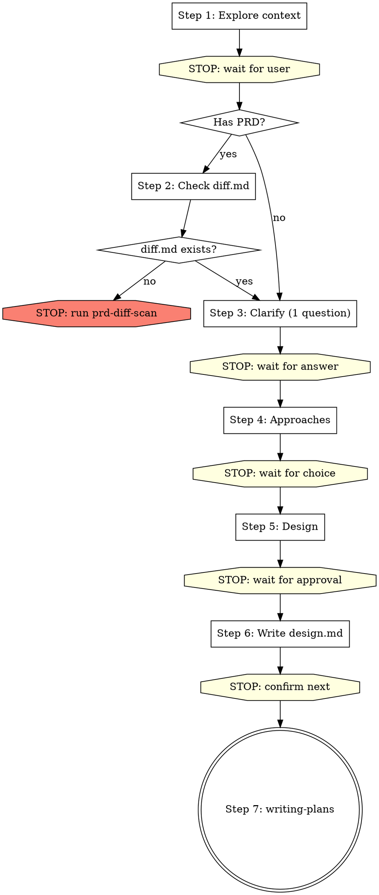

# Brainstorming Ideas Into Designs

## Overview

Help turn ideas into fully formed designs and specs through natural collaborative dialogue.

Start by understanding the current project context, then ask questions one at a time to refine the idea. Once you understand what you're building, present the design and get user approval.

<HARD-GATE>
Do NOT invoke any implementation skill, write any code, scaffold any project, or take any implementation action until you have presented a design and the user has approved it. This applies to EVERY project regardless of perceived simplicity.
</HARD-GATE>

## Restrictions

- This skill can ONLY create `*-design.md` documents (in Step 6)
- Do NOT create: `*-diff.md`, `*-plan.md`, `*-db-design.md` — these belong to other skills
- **One step per turn**: complete one step, then STOP and wait for user to reply. Do NOT continue to the next step in the same turn.
- Do NOT do the diff scan yourself. If diff.md is missing, stop and tell the user.

---

## Steps (one step per turn — STOP after each step and wait for user)

You MUST create a task for each step and complete them in order.
**Each step = one conversation turn.** After completing a step, end your message and wait for user input.

---

### Step 1: Explore project context

- Check out the current project state (files, docs, recent commits)
- Understand what the user wants to build

**After completing exploration, end your turn.** Present a brief summary of what you found and ask the user one clarifying question.

---

### Step 2: Check PRD diff scan prerequisite

If no PRD / prototype / requirement doc was provided → skip to Step 3.

If user provided PRD or requirement doc:

1. Use Glob to check if `docs/plans/*-diff.md` exists
2. If exists → Read the diff document, note any unresolved Blockers, then proceed to Step 3
3. If NOT exists → **STOP. End your turn immediately.** Output only this:

> ❌ 差异扫描文档不存在。请先单独执行 `prd-diff-scan` skill 完成差异扫描：
> `Skill("superpowers:prd-diff-scan")`
> 差异扫描完成后再执行 brainstorming。

Do NOT create the diff document yourself. Do NOT continue. End your turn.

---

### Step 3: Ask clarifying questions

- One question at a time — do NOT ask multiple questions in one message
- If diff scan has unresolved Blockers, resolve them here before proceeding
- Focus on: purpose, constraints, success criteria, business rules

**Ask ONE question, then STOP and wait for user reply.** Repeat Step 3 until all questions are answered. Then proceed to Step 4 in the NEXT turn.

---

### Step 4: Propose 2-3 approaches

- Present 2-3 different approaches with trade-offs
- Lead with your recommended option and explain why

**After presenting approaches, STOP and wait for user to choose.** Do NOT proceed to Step 5 in the same turn.

---

### Step 5: Present design

- Scale each section to its complexity
- Cover: architecture, components, data flow, error handling, testing
- Ask after each section whether it looks right so far

**After presenting each section, STOP and wait for user feedback.** Only after user approves all sections, output:

→ **CHECKPOINT**: "✅ 用户已确认设计：`[一句话总结]`。"

---

### Step 6: Write design doc

- Save the validated design to `docs/plans/YYYY-MM-DD-<topic>-design.md`
- This is the ONLY document this skill creates. Do NOT create plan.md, db-design.md, or diff.md.
- Commit the design document to git

→ **CHECKPOINT**: "✅ 设计文档已保存到 `[路径]`。可以进入实施计划。"

**After saving, STOP.** Ask user: "设计文档已保存。是否现在进入实施计划（writing-plans）？"

---

### Step 7: Transition to implementation

Only after user confirms → invoke the writing-plans skill.
Do NOT invoke any other skill. writing-plans is the ONLY next step.

---

## Process Flow

## Key Principles

- **One step per turn** - Complete one step, stop, wait for user
- **One question at a time** - Don't overwhelm with multiple questions
- **Multiple choice preferred** - Easier to answer than open-ended when possible
- **YAGNI ruthlessly** - Remove unnecessary features from all designs
- **Explore alternatives** - Always propose 2-3 approaches before settling
- **Blockers first** - If diff scan found blockers, resolve them before proposing approaches
