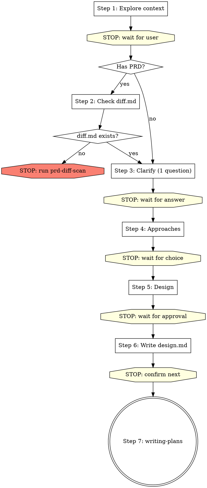

# Brainstorming Ideas Into Designs

## Overview

Help turn ideas into fully formed designs and specs through natural collaborative dialogue.

Start by understanding the current project context, then ask questions one at a time to refine the idea. Once you understand what you're building, present the design and get user approval.

If the user explicitly wants **详细设计** and the project has templates under `spec/`, use the matching template when you save the final document.

In a PRD/UI-driven development-design workflow, treat detailed design as the default written output for every in-scope side:
- Frontend is in scope when the input or diff mentions a UI project, page paths, page interactions, or frontend changes/blockers.
- Backend is in scope when the input or diff mentions APIs, controllers/services/mappers, database work, SAP/mock integration, or backend changes/blockers.
- If both sides are in scope and the user did not explicitly narrow scope, you MUST produce two detailed-design docs before any planning: **先写前端，再基于前端文档写后端**。

## 自动测试 / 非交互模式（窄例外）

默认仍然是**一步一轮、逐轮确认**。

只有同时满足以下条件，才允许把多步串起来自动执行：

- 用户明确说这是自动测试、CI、批处理或非交互场景
- 用户明确说：没有 blocker 时，默认采用推荐方案
- 用户明确说：默认同意继续下一步、默认同意落盘

启用后可以这样做：

- 不必在 Step 3 / Step 4 / Step 5 / Step 6 之间逐轮停下
- 可以把用户的授权视为：已批准推荐方案、已批准继续、已批准保存文档
- 如果用户明确要详细设计，可以直接写并落盘 `*-detail-design.md`

但下面这些情况仍然**必须停**：

- diff 里还有未解决 blocker
- 关键业务规则不清
- 前后端模板所需信息明显不足
- 你需要用户拍板而不是推荐

<HARD-GATE>
Do NOT invoke any implementation skill, write any code, scaffold any project, or take any implementation action until you have presented a design and the user has approved it. This applies to EVERY project regardless of perceived simplicity.

Replies like `继续`, `下一步`, `往下走`, or answers to clarification questions do NOT count as design approval on their own. Outside explicit auto-test / non-interactive mode, you must still save the design docs, STOP, and wait for an explicit confirmation to enter `writing-plans`.
</HARD-GATE>

## Restrictions

- This skill can create `*-design.md` documents, and it may create `*-detail-design.md` when the user explicitly asks for detailed design
- Do NOT create: `*-diff.md`, `*-plan.md`, `*-db-design.md` — these belong to other skills
- **One step per turn**: complete one step, then STOP and wait for user to reply. Do NOT continue to the next step in the same turn.
- In explicit auto-test / non-interactive mode, you may combine steps after prerequisites are satisfied and no blockers remain.
- Do NOT do the diff scan yourself. If diff.md is missing, stop and tell the user.
- If both frontend and backend are in scope, Step 5 must present both sides (先前端后后端) and Step 6 must save two docs (先前端，再基于前端写后端). Do NOT silently drop one side because it looks "already implemented".

---

## Steps (one step per turn — STOP after each step and wait for user)

You MUST create a task for each step and complete them in order.
**Each step = one conversation turn.** After completing a step, end your message and wait for user input.

---

### Step 1: Explore project context

- Check out the current project state (files, docs, recent commits)
- Understand what the user wants to build
- If `spec/index.md` exists, read it. If the user wants frontend/backend detailed design, also note the matching template path under `spec/`

**After completing exploration, end your turn.** Present a brief summary of what you found and ask the user one clarifying question.

In explicit auto-test / non-interactive mode, if the user already supplied the needed defaults and there are no blockers, you may continue without stopping.

---

### Step 2: Check PRD diff scan prerequisite

If no PRD / requirement doc was provided → skip to Step 3.

If user provided PRD or requirement doc:

1. Use Glob to check if `docs/plans/*-diff.md` exists
2. If exists → Read the diff document, then **验证完整性**：
   - 每个 PRD 页面是否都有 5 维度对比（UI 可视要素 + 控件矩阵 + 字段对比 + 9 维度 + 验收点）
   - 差异清单 Dx 是否覆盖了对比表中所有「差异」行
   - 建议决议是否逐项覆盖了所有 Dx 和 Bx
   - 如果不完整 → **STOP**，告知用户差异扫描不完整，需重新执行 `prd-diff-scan`
   - 如果完整 → 提取差异决议表中所有「⏳ 待确认」的 Dx 和 Bx 条目，统计待确认总数，告知用户"Step 3 将逐项确认这 N 项差异和 Blockers"，然后 proceed to Step 3
3. If NOT exists → **STOP. End your turn immediately.** Output only this:

> ❌ 差异扫描文档不存在。请先单独执行 `prd-diff-scan` skill 完成差异扫描：
> `Skill("superpowers:prd-diff-scan")`
> 差异扫描完成后再执行 brainstorming。

Do NOT create the diff document yourself. Do NOT continue. End your turn.

---

### Step 3: 逐项确认差异决议 + 需求澄清

当存在 diff 文档时，Step 3 的**首要任务**是逐项确认差异决议表中所有「⏳ 待确认」的 Dx 和 Bx。**全部确认完毕之前，不得进入 Step 4。**

#### 3a. 逐项确认差异决议（diff 文档存在时必做）

每轮展示**一批**待确认项（建议 3-5 项/批），格式如下：

```
以下差异项需要您确认（第 X/Y 批，共 N 项待确认）：

| 编号 | 差异/问题摘要 | 建议处理方案 | 您的决定 |
|------|-------------|-------------|---------|
| D1 | [摘要] | [建议方案] | ⏳ 请确认 |
| D2 | [摘要] | [建议方案] | ⏳ 请确认 |
| D3 | [摘要] | [建议方案] | ⏳ 请确认 |

请逐项确认：同意建议 / 选择其他方案 / 有疑问需讨论。
```

流程：
- 用户回复后，记录每项的用户决定
- **STOP，等待用户回复**
- 展示下一批待确认项
- **重复直到所有 Dx 和 Bx 都已确认**
- 全部确认后，用 Edit 工具更新 diff 文档的差异决议表（将「⏳ 待确认」改为「✅ + 用户选择的方案」），并输出确认完成的 checkpoint：

> **CHECKPOINT**: "✅ 差异决议已全部确认（Dx __ 项 + Bx __ 项 = __ 项），diff 文档已更新。"

#### 3b. 其他澄清问题（差异全部确认后）

差异决议全部确认后，如果还有其他需要澄清的问题：
- One question at a time — do NOT ask multiple questions in one message
- Focus on: purpose, constraints, success criteria, business rules

**Ask ONE question, then STOP and wait for user reply.** Repeat until all questions answered.

#### Step 3 → Step 4 门禁

**以下条件全部满足后才能进入 Step 4：**
1. diff 文档的差异决议表中所有 Dx 和 Bx 都已标记 ✅（用户已逐项确认）
2. diff 文档已更新落盘
3. 没有剩余的澄清问题

如果任一条件不满足，继续 Step 3。不得跳过未确认的差异项。

In explicit auto-test / non-interactive mode, if the user already pre-approved the recommended defaults and no blockers remain, you may resolve Step 3 without stopping.

---

### Step 4: Propose 2-3 approaches

- Present 2-3 different approaches with trade-offs
- Lead with your recommended option and explain why

**After presenting approaches, output the following then STOP：**

→ "请选择方案（A / B / C），或提出其他想法。"

<HARD-STOP>
**Do NOT proceed to Step 5 in the same turn.**
This is the most commonly violated gate. After presenting approaches, you MUST end your turn and wait for the user to explicitly choose an approach.
Even if you think the choice is obvious, STOP and wait.
</HARD-STOP>

#### Step 4 → Step 5 门禁

**以下条件全部满足后才能进入 Step 5：**
1. 用户已明确选择了一个方案（如"方案A"、"推荐方案"、"第一个"）
2. 方案选择发生在**用户的回复中**，不是你自己推断的

如果用户只说"继续"/"下一步"而没有选方案，追问"请先选择方案 A / B / C"。不得默认采用推荐方案。

In explicit auto-test / non-interactive mode, you may proceed with your recommended option if the user pre-approved that behavior.

---

### Step 5: Present design

- Scale each section to its complexity
- Cover: architecture, components, data flow, error handling, testing
- If this is a detailed-design request, align the sections with the matching template under `spec/`
- If both frontend and backend are in scope, **先展示前端设计，再展示后端设计**；后端设计的接口清单必须对齐前端控件矩阵中的「调用接口」列
- Ask after each section whether it looks right so far

**After presenting each section, STOP and wait for user feedback.** Only after user approves all sections, output:

In explicit auto-test / non-interactive mode, you may treat the user's pre-approval as approval for all sections unless a blocker appears.

→ **CHECKPOINT**: "✅ 用户已确认设计：`[一句话总结]`。"

---

### Step 6: Write design doc

- If this is a normal design, save it to `docs/plans/YYYY-MM-DD-<topic>-design.md`
- Determine scope before writing:
  - Frontend in scope → use `spec/frontend/vue/detail-design-template.md` and save `docs/plans/YYYY-MM-DD-<topic>-frontend-detail-design.md`
  - Backend in scope → use `spec/backend/java/detail-design-template.md` and save `docs/plans/YYYY-MM-DD-<topic>-backend-detail-design.md`
- If both frontend and backend are in scope, you MUST write both detailed-design docs before ending the turn
- **前后端都在范围内时的写入顺序**：
  1. **先写前端** `*-frontend-detail-design.md`，通过下方「前端详细设计必填检查」
  2. **再写后端** `*-backend-detail-design.md`，后端文档必须：
     - 在「需求输入」里引用前端详细设计文档路径（如 `前端详细设计: docs/plans/YYYY-MM-DD-<topic>-frontend-detail-design.md`）
     - 接口清单（Section 3）覆盖前端控件矩阵（3.5）中所有「调用接口」列出现的接口，不得遗漏
     - 每个接口的请求参数 / 返回结构与前端类型设计（Section 6）保持一致
     - 如果前端控件矩阵出现了后端模板里没有的接口场景（如导出、批量操作），后端也必须补上
- If one side is intentionally out of scope, say so explicitly before writing and record that decision in the saved design output
- Design docs must be written to disk. Do NOT leave them only in chat.

#### 前端详细设计必填检查

生成 `*-frontend-detail-design.md` 时，以下 section 为**必填项**，不得跳过或留占位文本：

| Section | 必须包含 |
|---------|---------|
| 3.2 页面导航关系图 | Mermaid `graph` 画出页面间跳转关系；**只含页面节点**，不含动作节点 |
| 3.3 页面-控件组合图 | Mermaid `graph` 用 CXX 编号列出所有控件，**包括弹窗/抽屉内控件**；多页面时每页单独一张图；单张图不超过 20 个节点 |
| 3.4 控件交互关系图 | Mermaid `graph` 使用标准边类型（清空/刷新/触发/禁用·启用/显示·隐藏/打开·关闭/回填）；多页面时每页单独一张图 |
| 3.5 控件矩阵 | **3.1 中列出的每个页面**都必须有对应子表（不得只写第一个页面）；每行必须有「业务说明」；附「控件状态条件」子表 |
| 8.0 页面初始化 | **每个页面**的挂载行为（加载字典、初始默认值、自动查询） |
| 8.1-8.4 按控件 | **每个页面**的每个交互控件 CXX 都要写，先写**业务场景**再写技术流程，含成功/失败/空态 |
| 8.5 空态与异常 | 无数据和接口异常场景的展示与可操作控件 |
| 10 自检清单 | 模板 Section 10 的 14 项检查全部标记 ✅ 才可保存 |

以上任一 section 缺失或用占位文本糊弄 → 文档不合格，不得保存。

#### 自检门禁

保存 `*-frontend-detail-design.md` 前，必须：
1. 填写模板 Section 10 自检清单，逐项标记 ✅ / ❌
2. 如有任何 ❌ → 修正对应内容后重新检查
3. 全部 14 项 ✅ → 方可执行 Write 保存文档

#### 后端详细设计必填检查

生成 `*-backend-detail-design.md` 时，以下 section 为**必填项**，不得跳过或留占位文本：

| Section | 必须包含 |
|---------|---------|
| 需求输入 | 引用前端详细设计文档路径 |
| 2 受影响模块 | 3.1 接口清单中**每个 Controller** 都有对应的 Service + Mapper |
| 3.1 接口清单 | 覆盖前端控件矩阵中所有「调用接口」 |
| 3.2 接口详细定义 | 每个接口有权限标注；非 CRUD 接口有请求体 DTO；**每个写操作接口（POST/PUT/DELETE）有「业务逻辑」小节，用有序步骤描述完整实现（校验→前置检查→核心操作→异常分支→返回值），不得只写结论** |
| 4.2 关键字段 | 与前端类型设计**逐字段对齐**，**不得用省略号** |
| 4.3 DTO 设计 | 查询参数 DTO 覆盖前端 `queryParams` 所有字段；非标准操作有请求体 DTO |
| 5.1 表字段 | **完整列出**，不得用省略号；注明默认值约定和删除策略 |
| 6.1 方法清单 | 覆盖 3.1 中**每个接口** |
| 6.2 跨接口规则 | 只写状态机/数据权限注入等跨接口通用规则；单接口逻辑已在 3.2「业务逻辑」中写清 |
| 7 查询 SQL | **每个查询接口**都有伪 SQL（主表/动态条件类型/排序），不需要完整 XML |
| 10 前后端对齐 | 四张对齐表已填写（接口覆盖 + 请求参数 + 响应字段 + 枚举值） |
| 自检清单 | 模板头部自检清单 12 项全部标记 ✅ 才可保存 |

以上任一 section 缺失或用占位文本糊弄 → 文档不合格，不得保存。

#### 后端完整链路防护规则（致命级）

**每个 Controller 必须有完整的下游链路**：Entity + DTO + Service + Mapper + XML + 伪 SQL。

自检方式：列出 Section 3.1 接口清单中所有 Controller，逐个核对：

| Controller | Entity (4.2) | QueryDTO (4.3) | Service (6.1) | Mapper (2) | XML (2) | 伪 SQL (7) |
|------------|-------------|-----------------|--------------|------------|---------|------------|
| XxxController | ✅/❌ | ✅/❌ | ✅/❌ | ✅/❌ | ✅/❌ | ✅/❌ |

**任一 ❌ = 文档不合格**，必须补全后再保存。

常见遗漏场景（必须警惕）：
- Controller 接口定义了，但因为"TODO 对接外部系统"就跳过了 Entity/Service/Mapper — **禁止**。即使真实调用逻辑留空，编译所需的 Entity/Service/Mapper 必须定义
- 多个 Controller 共用一个 Entity，但其中某个 Controller 的专用 DTO/Service 方法被遗漏 — **必须逐个检查**
- Section 2 受影响模块表只列了部分 Controller 的 Service/Mapper — **必须与 3.1 接口清单 1:1 对齐**

#### 前端 API 文件覆盖防护规则

**每个不同的 API 基路径必须有对应的 API 文件**：

检查前端控件矩阵（3.5）中所有「调用接口」列，提取不同的 API 基路径（如 `/order/xxx` 和 `/inventory/consignment/xxx` 是两个不同基路径）。每个基路径在 Section 2 受影响文件中都必须有对应的 API 文件。

遗漏示例：控件矩阵中有 `GET /inventory/consignment/list`，但 Section 2 只列了 `api/order/index.ts` — 缺少 `api/inventory/index.ts`。

#### 后端自检门禁

保存 `*-backend-detail-design.md` 前，必须：
1. 填写模板头部自检清单，逐项标记 ✅ / ❌
2. 如有任何 ❌ → 修正对应内容后重新检查
3. 全部 12 项 ✅ → 方可执行 Write 保存文档
- Do NOT create plan.md, db-design.md, or diff.md here.
- Commit the design document to git

→ **CHECKPOINT**: "✅ 设计文档已保存到 `[路径]`。可以进入实施计划。"

**After saving, STOP.** Ask user: "设计文档已保存。是否现在进入实施计划（writing-plans）？"

Do NOT create `*-plan.md`, invoke `writing-plans`, or start coding in the same turn unless this is explicit auto-test / non-interactive mode with prior user approval to continue automatically.

In explicit auto-test / non-interactive mode, you may stop immediately after saving and report the saved paths.

---

### Step 7: Transition to implementation

Only after user explicitly confirms the saved design docs are approved → invoke the writing-plans skill.
If the user only says `继续` / `下一步`, treat that as permission to continue the current discussion, not as permission to create a plan or start implementation.
Do NOT invoke any other skill. writing-plans is the ONLY next step.

---

## Process Flow



## Key Principles

- **One step per turn** - Complete one step, stop, wait for user
- **One question at a time** - Don't overwhelm with multiple questions
- **Multiple choice preferred** - Easier to answer than open-ended when possible
- **YAGNI ruthlessly** - Remove unnecessary features from all designs
- **Explore alternatives** - Always propose 2-3 approaches before settling
- **Blockers first** - If diff scan found blockers, resolve them before proposing approaches
