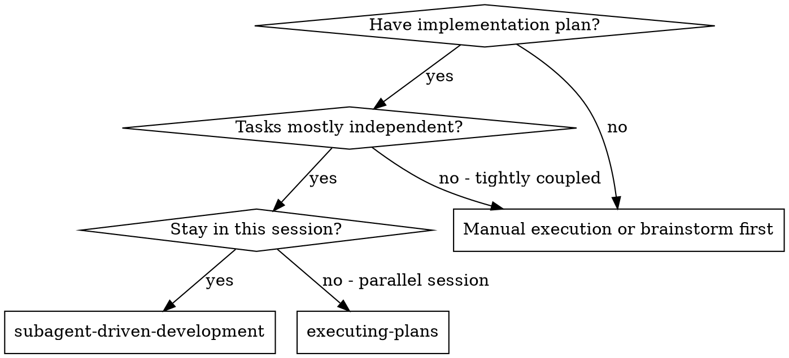
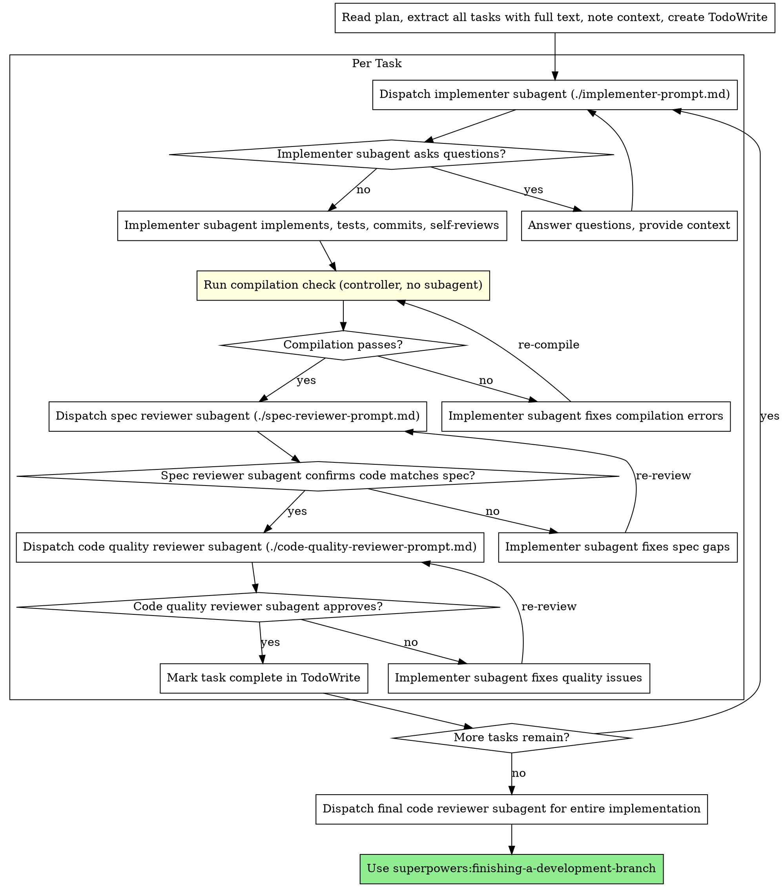

# Subagent-Driven Development

Execute plan by dispatching fresh subagent per task, with compilation gate + two-stage review after each: compilation check first, then spec compliance review, then code quality review.

**Core principle:** Fresh subagent per task + compilation gate + two-stage review (spec then quality) = high quality, fast iteration

## When to Use



**vs. Executing Plans (parallel session):**
- Same session (no context switch)
- Fresh subagent per task (no context pollution)
- Compilation gate + two-stage review after each task: compile first, then spec compliance, then code quality
- Faster iteration (no human-in-loop between tasks)

## Controller Role Boundaries

CRITICAL: The controller (you) is an orchestrator, NOT an implementer.

### Controller MUST:
- Read plan, extract tasks, create TodoWrite
- Dispatch implementer subagent per task (via Agent tool)
- Answer subagent questions
- Run compilation check (controller runs build command directly)
- Dispatch spec reviewer subagent (via Agent tool)
- Dispatch code quality reviewer subagent (via Agent tool)
- Output gate evidence block before marking each task complete
- Update plan.md task status and index.md progress

### Controller MUST NOT:
- Write implementation code (that's the implementer subagent's job)
- Review code itself and claim it replaces subagent review
- Mark a task complete without all 3 gates passing
- Skip dispatching any subagent (even if "code looks fine")
- Proceed to next task with open review issues

If you catch yourself writing implementation code instead of dispatching a subagent, STOP. You are violating the controller role boundary.

## The Process



## Prompt Templates

- `./implementer-prompt.md` - Dispatch implementer subagent
- `./spec-reviewer-prompt.md` - Dispatch spec compliance reviewer subagent
- `./code-quality-reviewer-prompt.md` - Dispatch code quality reviewer subagent

## Timing Instrumentation

**Purpose:** Record wall-clock time for every step to identify bottlenecks.

### How to Record

At each measurement point, run:
```bash
date +%s
```
Store the result in a shell variable or note it down. Calculate duration = end - start.

### Measurement Points (Per Task)

| Point | When | Variable |
|-------|------|----------|
| `T_TASK_START` | Before dispatching implementer | `t0` |
| `T_IMPL_END` | After implementer returns | `t1` |
| `T_COMPILE_START` | Before running build command | `t2` |
| `T_COMPILE_END` | After build finishes | `t3` |
| `T_SPEC_START` | Before dispatching spec reviewer | `t4` |
| `T_SPEC_END` | After spec reviewer returns | `t5` |
| `T_QUALITY_START` | Before dispatching quality reviewer | `t6` |
| `T_QUALITY_END` | After quality reviewer returns | `t7` |
| `T_TASK_END` | After status updates complete | `t8` |

**For fix loops:** If a gate fails and requires fix + re-review, record each iteration:
- `T_FIX_N_START`, `T_FIX_N_END` — implementer fix
- `T_REREVIEW_N_START`, `T_REREVIEW_N_END` — re-review

### Timing Log File

After each task completes, append to `timing.md` in the plan directory (same level as `plan.md`).

Format:
```markdown
## Task N: [task name]

| Phase | Start (epoch) | End (epoch) | Duration (s) | Duration (human) |
|-------|--------------|------------|--------------|-----------------|
| Implementation | {t0} | {t1} | {t1-t0} | {mm:ss} |
| Compilation | {t2} | {t3} | {t3-t2} | {mm:ss} |
| Spec Review | {t4} | {t5} | {t5-t4} | {mm:ss} |
| Code Quality Review | {t6} | {t7} | {t7-t6} | {mm:ss} |
| Status Updates | {t7} | {t8} | {t8-t7} | {mm:ss} |
| **Total** | {t0} | {t8} | {t8-t0} | **{mm:ss}** |

Fix loops: [none / N iterations, total Xs]
```

**Human-readable duration:** Convert seconds to `Xm Ys` format (e.g., `12m 34s`).

### Controller Timing Protocol

1. **Before dispatching implementer:** `date +%s` → save as `t0`
2. **After implementer returns:** `date +%s` → save as `t1`
3. **Before compilation:** `date +%s` → save as `t2`
4. **After compilation:** `date +%s` → save as `t3`
5. **Before spec reviewer:** `date +%s` → save as `t4`
6. **After spec reviewer returns:** `date +%s` → save as `t5`
7. **Before quality reviewer:** `date +%s` → save as `t6`
8. **After quality reviewer returns:** `date +%s` → save as `t7`
9. **After all status updates:** `date +%s` → save as `t8`
10. **Append timing block** to `timing.md`

**CRITICAL:** Timing is mandatory. Every task MUST have a timing block in `timing.md`. Missing timing = process violation.

## Hard Gates (Non-Negotiable)

CRITICAL: These gates are sequential. Each MUST pass before proceeding to the next. Skipping ANY gate = process failure.

### Gate 1: Compilation
- Controller runs build command directly (no subagent)
- MUST see actual build output with exit 0
- Failure → dispatch implementer subagent to fix → re-compile

### Gate 2: Spec Compliance
- MUST dispatch spec-reviewer subagent via Agent tool
- Controller reviewing code itself does NOT satisfy this gate
- Subagent must independently read code and verify against design docs
- Use `./spec-reviewer-prompt.md` template
- Failure → implementer subagent fixes → re-dispatch spec reviewer

### Gate 3: Code Quality
- MUST dispatch code-quality-reviewer subagent via Agent tool
- Only after Gate 2 passes
- Controller reviewing code itself does NOT satisfy this gate
- Use `./code-quality-reviewer-prompt.md` template
- Failure → implementer subagent fixes → re-dispatch code quality reviewer

### Gate Evidence Block (Mandatory Output)

Before marking ANY task complete, output this block. Missing this block = task is NOT complete.

```
### Task N Gate Evidence
| Gate | Status | Duration | Evidence |
|------|--------|----------|----------|
| Implementation | ✅/❌ | Xm Ys | subagent dispatched: [yes/no], report: [summary] |
| Compilation | ✅/❌ | Xm Ys | command: [cmd], exit code: [0/non-zero] |
| Spec Review | ✅/❌ | Xm Ys | subagent dispatched: [yes/no], verdict: [pass/fail + issues] |
| Code Quality | ✅/❌ | Xm Ys | subagent dispatched: [yes/no], verdict: [pass/fail + issues] |
| **Total** | | **Xm Ys** | |

All gates ✅ → Task N COMPLETE
Any gate ❌ → Task N remains IN PROGRESS
```

Any row with "subagent dispatched: no" = gate NOT satisfied, regardless of any other claim.

## Example Workflow

```
You: I'm using Subagent-Driven Development to execute this plan.

[Read index.md: docs/plans/<task>/index.md]
[Read first page plan: docs/plans/<task>/shared-plan.md or <page>/plan.md]
[Extract all tasks from current page plan with full text and context]
[Create TodoWrite with current page tasks]

Task 1: Hook installation script

[Get Task 1 text and context (already extracted)]
[Dispatch implementation subagent with full task text + context]

Implementer: "Before I begin - should the hook be installed at user or system level?"

You: "User level (~/.config/superpowers/hooks/)"

Implementer: "Got it. Implementing now..."
[Later] Implementer:
  - Implemented install-hook command
  - Added tests, 5/5 passing
  - Self-review: Found I missed --force flag, added it
  - Committed

[Run compilation check - controller runs build command directly]
Compilation: ✅ Build successful

[Dispatch spec compliance reviewer]
Spec reviewer: ✅ Spec compliant - all requirements met, nothing extra

[Get git SHAs, dispatch code quality reviewer]
Code reviewer: Strengths: Good test coverage, clean. Issues: None. Approved.

### Task 1 Gate Evidence
| Gate | Status | Duration | Evidence |
|------|--------|----------|----------|
| Implementation | ✅ | 11m 23s | subagent dispatched: yes, report: Implemented install-hook command, 5/5 tests passing |
| Compilation | ✅ | 2m 05s | command: `npm run build`, exit code: 0 |
| Spec Review | ✅ | 8m 47s | subagent dispatched: yes, verdict: pass - all requirements met |
| Code Quality | ✅ | 7m 12s | subagent dispatched: yes, verdict: pass - clean code, good tests |
| **Total** | | **29m 27s** | |

All gates ✅ → Task 1 COMPLETE

[Mark Task 1 complete]

Task 2: Recovery modes

[Get Task 2 text and context (already extracted)]
[Dispatch implementation subagent with full task text + context]

Implementer: [No questions, proceeds]
Implementer:
  - Added verify/repair modes
  - 8/8 tests passing
  - Self-review: All good
  - Committed

[Run compilation check]
Compilation: ✅ Build successful

[Dispatch spec compliance reviewer]
Spec reviewer: ❌ Issues:
  - D1 (Requirements): Missing progress reporting (spec says "report every 100 items")
  - D1 (Requirements): Extra - Added --json flag (not requested)

[Implementer fixes issues]
Implementer: Removed --json flag, added progress reporting

[Spec reviewer reviews again]
Spec reviewer: ✅ Spec compliant now

[Dispatch code quality reviewer]
Code reviewer: Strengths: Solid. Issues (Important): Magic number (100)

[Implementer fixes]
Implementer: Extracted PROGRESS_INTERVAL constant

[Code reviewer reviews again]
Code reviewer: ✅ Approved

[Mark Task 2 complete]

...

[After all tasks]
[Dispatch final code-reviewer]
Final reviewer: All requirements met, ready to merge

Done!
```

## Advantages

**vs. Manual execution:**
- Subagents follow TDD naturally
- Fresh context per task (no confusion)
- Parallel-safe (subagents don't interfere)
- Subagent can ask questions (before AND during work)

**vs. Executing Plans:**
- Same session (no handoff)
- Continuous progress (no waiting)
- Review checkpoints automatic

**Efficiency gains:**
- No file reading overhead (controller provides full text)
- Controller curates exactly what context is needed
- Subagent gets complete information upfront
- Questions surfaced before work begins (not after)

**Quality gates:**
- Self-review catches issues before handoff
- Compilation gate: code must compile before any review (hard gate, no subagent)
- Two-stage review: spec compliance, then code quality
- Spec compliance checks: business logic vs detailed design, backend↔frontend params, SQL↔backend fields
- Review loops ensure fixes actually work
- Spec compliance prevents over/under-building
- Code quality ensures implementation is well-built

**Cost:**
- More subagent invocations (implementer + 2 reviewers per task)
- Controller does more prep work (extracting all tasks upfront)
- Review loops add iterations
- But catches issues early (cheaper than debugging later)

## Red Flags

**Never:**
- **Write implementation code as controller** (you are the orchestrator, not the implementer — dispatch a subagent)
- **Mark a task complete without outputting the Gate Evidence Block** (no evidence block = not complete)
- Start implementation on main/master branch without explicit user consent
- Skip reviews (spec compliance OR code quality)
- Proceed with unfixed issues
- Dispatch multiple implementation subagents in parallel (conflicts)
- Make subagent read plan file (provide full text instead)
- Skip scene-setting context (subagent needs to understand where task fits)
- Ignore subagent questions (answer before letting them proceed)
- Accept "close enough" on spec compliance (spec reviewer found issues = not done)
- Skip review loops (reviewer found issues = implementer fixes = review again)
- Let implementer self-review replace actual review (both are needed)
- **Start code quality review before spec compliance is ✅** (wrong order)
- **Start spec compliance review before compilation passes** (wrong order)
- Move to next task while either review has open issues

**If subagent asks questions:**
- Answer clearly and completely
- Provide additional context if needed
- Don't rush them into implementation

**If reviewer finds issues:**
- Implementer (same subagent) fixes them
- Reviewer reviews again
- Repeat until approved
- Don't skip the re-review

**If subagent fails task:**
- Dispatch fix subagent with specific instructions
- Don't try to fix manually (context pollution)

### Known Failure Modes (from real incidents)

**Failure Mode 1: Controller becomes implementer**
The controller read existing code, fixed compilation errors, wrote new files, compiled successfully, and declared all tasks complete. NO subagents were dispatched — not for implementation, not for spec review, not for code quality review. The controller did everything itself and skipped all review gates.

Why it happened: The SKILL.md described the process but didn't enforce it. The controller took a shortcut.

How to detect: If you're writing implementation code (not build commands), you've become the implementer. STOP and dispatch a subagent instead.

**Failure Mode 2: Compilation-only quality gate**
The controller ran `mvn install -DskipTests`, saw it pass, and declared all tasks complete. Compilation passing only proves syntax is correct — it says nothing about business logic, spec compliance, or code quality.

Why it happened: The controller treated "compiles" as "done" and skipped the two review stages entirely.

How to detect: If your gate evidence block only has Compilation filled in, you've skipped 2 of 3 gates.

**Failure Mode 3: No plan status updates**
The controller completed work but never updated `plan.md` task status table or `index.md` progress table. There's no record of what was done.

How to detect: After completing a task, if you haven't written to plan.md and index.md, the task tracking is broken.

## Integration

**Required workflow skills:**
- **superpowers:using-git-worktrees** - REQUIRED: Set up isolated workspace before starting
- **superpowers:writing-plans** - Creates the plan this skill executes
- **superpowers:requesting-code-review** - Code review template for reviewer subagents
- **superpowers:finishing-a-development-branch** - Complete development after all tasks
- **superpowers:verification-before-completion** - REQUIRED: Evidence before any completion claims. Applies to each gate.

**Subagents should use:**
- **superpowers:test-driven-development** - Subagents follow TDD for each task

**Alternative workflow:**
- **superpowers:executing-plans** - Use for parallel session instead of same-session execution
