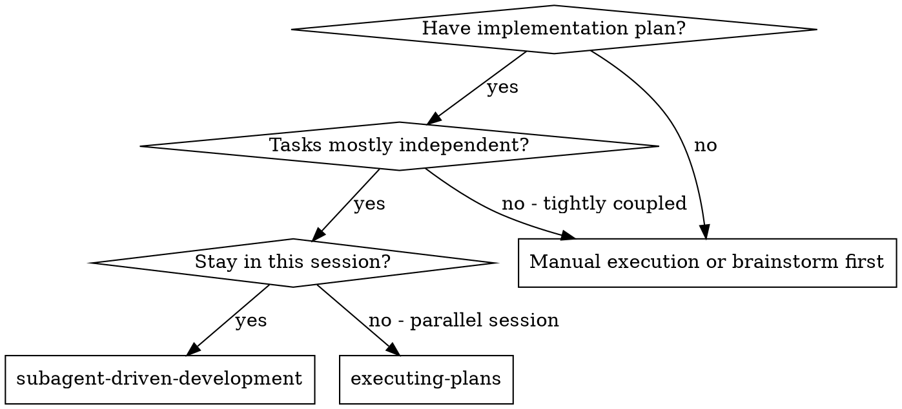
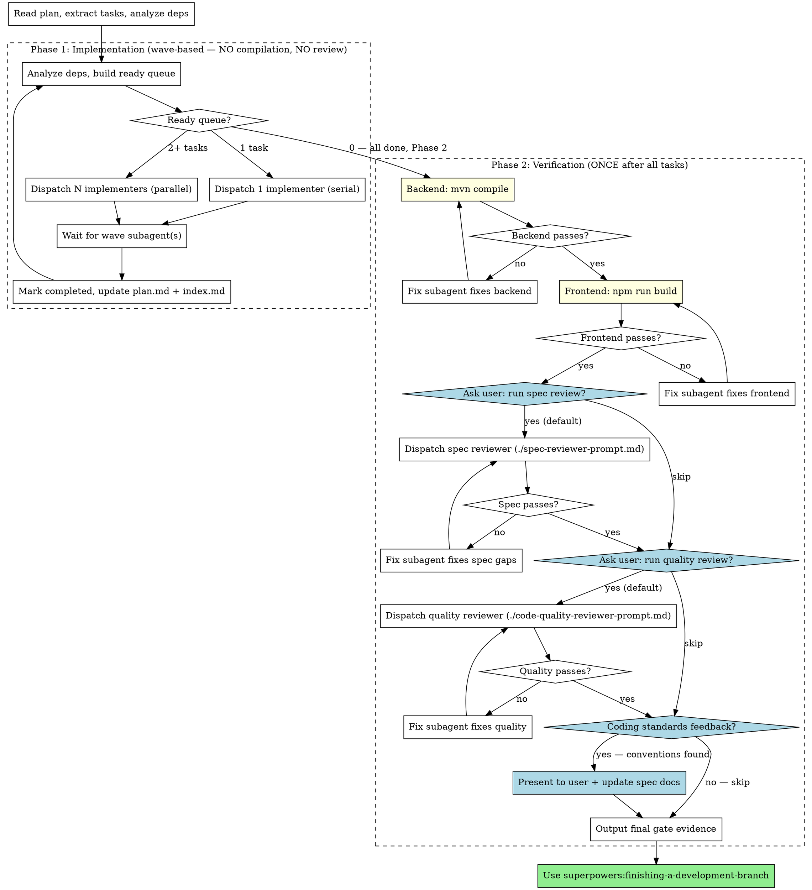

# Subagent-Driven Development

Execute plan by dispatching fresh subagent per task. Compilation and review are **deferred** to after all tasks complete (CLAUDE.md Rule 6/7).

**Core principle:** Fresh subagent per task + 无依赖 task 自动并行 + deferred compilation (Rule 6) + deferred review (Rule 7) = high quality, fast iteration

## When to Use



**vs. Executing Plans (parallel session):**
- Same session (no context switch)
- Fresh subagent per task (no context pollution)
- Faster iteration (no human-in-loop between tasks)

## Controller Role Boundaries

CRITICAL: The controller (you) is an orchestrator, NOT an implementer.

### Controller MUST:
- Read plan, extract tasks, analyze dependencies, create TodoWrite
- Dispatch implementer subagent per task (serial) or per wave (parallel for independent tasks) via Agent tool
- Answer subagent questions
- Track the exact source worktree path and pass that same absolute path to every implementer subagent and verification command
- Update plan.md task status and index.md progress after each task/wave, but only after explicit completion evidence
- After ALL tasks: run compilation, dispatch reviewers, output final gate evidence

### Controller MUST NOT:
- Write implementation code (that's the implementer subagent's job)
- Run compilation between tasks (CLAUDE.md Rule 6: defer until all tasks done)
- Dispatch reviewers between tasks (CLAUDE.md Rule 7: defer until compilation passes)
- Treat timeout, missing exit code, missing agent handle, or "No task found with ID" as success
- Batch-mark multiple `未开始` tasks as `已完成`
- Mix source edits between the main repository root and the worktree after a worktree has been selected
- Mark the feature as complete without passing all final gates

If you catch yourself writing implementation code instead of dispatching a subagent, STOP. You are violating the controller role boundary.

## The Process (Two Phases)



## Prompt Templates

- `./implementer-prompt.md` - Dispatch implementer subagent
- `./spec-reviewer-prompt.md` - Dispatch spec compliance reviewer subagent (Phase 2 only)
- `./code-quality-reviewer-prompt.md` - Dispatch code quality reviewer subagent (Phase 2 only)

---

## Phase 1: Implementation

### Per-task flow (wave-based: 默认串行，无依赖自动并行)

**Step 0 — 依赖分析（进入 Phase 1 前一次性完成）：**
1. 扫描 plan.md 每个 Task 的依赖声明（`依赖: Task N`、`前置条件: ...`、`blockedBy: ...`）
2. **无显式依赖声明**的 Task → 视为仅依赖排在它前面的 Task（保守串行）
3. 构建依赖图，识别可并行的 Task 分组（wave）

**执行循环：**
1. **构建 ready queue**：所有依赖已满足（被依赖 Task 均 `已完成`）的待执行 Task
2. **判断 ready queue 大小**：
   - **0 个** → 全部完成，进入 Phase 2
   - **1 个** → 串行派发（与原流程相同）
   - **2+ 个** → 并行派发：单条消息中多个 Agent tool 调用同时派发
3. 每个 subagent：提供完整 task 文本 + 上下文 + worktree 绝对路径 → 回答提问 → 等待完成报告
4. 并行模式下等待当前 wave **全部** subagent 返回后再统一更新状态
5. **Mark task(s) complete** only after explicit implementation-complete evidence → 更新 plan.md + index.md → 回到步骤 1

**并行安全约束：**
- 仅当 Task 为垂直切片（Rule 5）且不修改相同文件时才可并行
- 2 个 ready task 描述中提到修改相同文件 → 降级为串行
- 任何 subagent 返回 NOT COMPLETE → 单独处理后再推进下一 wave

### What controller does NOT do in Phase 1

- ❌ Run `mvn compile` or `npm run build` (Rule 6: defer)
- ❌ Dispatch spec reviewer or code quality reviewer (Rule 7: defer)
- ❌ Output gate evidence blocks per task
- ❌ Wait for human review between tasks

### Phase 1 完成的含义

- Phase 1 中的 `Task 已完成` 指的是**实现完成**，不是**最终验证通过**
- 每个 Task 在 Phase 1 只要求：实现代码、返回修改文件和剩余风险
- 项目级验证（如 `mvn compile`、`npm run build`、统一代码审查）全部延迟到 Phase 2
- 不得因为单个 Task 未跑编译而阻止正常推进；编译是否通过由 Phase 2 统一裁决

### Status updates after each task

1. Update `<page>/plan.md` 任务状态 table: set status to `已完成`
2. Update `index.md` 执行进度 table: increment `已完成` count
3. On first task of a page: update `index.md` page `实施状态` to `进行中`
4. When all tasks of a page complete: update `index.md` page `实施状态` to `已完成`

> **注意**：状态回写目标是 CWD 下的 docs/plans（即 `DOC_ROOT`），不是 worktree 目录。

### 强制状态一致性规则

- 只有在以下条件全部满足时，Task 才能标记为 `已完成`:
  1. implementer subagent 已明确返回 `STATUS: COMPLETE`
  2. 返回结果包含实际修改文件清单
  3. 返回结果明确说明该 Task 已实现完成，且没有未处理 blocker
  4. `<page>/plan.md` 与 `index.md` 的状态更新都成功
- 以下情况一律不得标记 `已完成`:
  - Agent 句柄丢失或出现 `No task found with ID`
  - 任意命令超时
  - `Error editing file`
  - 仅凭文件存在性猜测任务可能完成
  - 该 Task 尚未实际派发
- 禁止批量预标记:
  - 不得将多个 `未开始` Task 一次性改为 `已完成`
  - 每个 Task 必须独立完成、独立更新状态
- 若状态更新失败:
  - Task 状态保持原状或标记为 `进行中`
  - 不得继续推进下一个 Task，必须先修复 `plan.md` / `index.md`

### Worktree 目录绑定

- 创建 worktree 后，记录其绝对路径为 `SOURCE_ROOT`（在 `PROJECT_ROOT` 下创建）
- 记录 CWD 绝对路径为 `DOC_ROOT`
- **`SOURCE_ROOT`**：所有源码修改、验证命令、子代理工作目录
- **`DOC_ROOT`**：所有文档读取（spec、设计文档）、计划进度回写（index.md、plan.md）
- Controller 自己读文档用 CWD 相对路径，派发 subagent 时传 `DOC_ROOT` 绝对路径
- 不得在未说明的情况下在主仓库和 worktree 之间来回切换源码路径

---

## Phase 2: Verification (after ALL tasks complete)

→ See [`shared/phase2-verification.md`](../shared/phase2-verification.md) for the complete Phase 2 verification process (Gates 1-5 + Final Gate Evidence).

**Entry condition:** All tasks in all page plans are marked `已完成`.

---

## Example Workflow

```
You: I'm using Subagent-Driven Development to execute this plan.

[Read index.md → find execution order]
[Read first page plan → extract all tasks with full text]
[Analyze dependencies → Task 1: no deps; Task 2,3: depend on Task 1; Task 4: depends on Task 2+3]

--- Phase 1: Implementation (wave-based) ---

Wave 1 (ready: Task 1 → serial):
  Task 1: Database tables
  [Dispatch implementer subagent]
  Implementer: Implemented.
  [Update plan.md: Task 1 已完成, update index.md]

Wave 2 (ready: Task 2, Task 3 → no shared files → parallel):
  [Dispatch Task 2 + Task 3 in parallel (2 Agent calls in one message)]
  Task 2 Implementer: "Should the date range be inclusive or exclusive?"
  You: "Inclusive on both ends."
  Task 3 Implementer: Implemented.
  Task 2 Implementer: Implemented.
  [All returned → Update plan.md: Task 2,3 已完成, update index.md]

Wave 3 (ready: Task 4 → serial):
  Task 4: Frontend integration
  [Dispatch implementer subagent]
  Implementer: Done.
  [Update plan.md + index.md: all pages 已完成]

--- Phase 2: Verification ---

[mvn compile]
Backend compilation: ✅ BUILD SUCCESS

[npm run build]
Frontend compilation: ❌ TS error in orderLedger.vue
[Dispatch fix subagent → fix type error]
[npm run build again]
Frontend compilation: ✅ Build successful

[Ask user: run spec review?]
User: "好" → execute

[Dispatch spec reviewer for entire implementation]
Spec reviewer: ❌ Missing D3 (internalRelatedPartyName filter in delivery-record)
[Dispatch fix subagent → add missing filter]
[Dispatch spec reviewer again]
Spec reviewer: ✅ All requirements met

[Ask user: run quality review?]
User: "执行" → execute

[Dispatch code quality reviewer]
Code reviewer: ✅ Approved. Minor: consider extracting shared date formatter.

[Coding Standards Feedback]
Review found: date formatter pattern should use `@JsonFormat(pattern = "yyyy-MM-dd")`
→ Present to user: "Should we add this to coding-standards.md?"
→ User approves → Update spec/backend/java/coding-standards.md

### Final Gate Evidence
| Gate | Status | Evidence |
|------|--------|----------|
| Backend Compilation | ✅ | command: `mvn compile`, exit code: 0 |
| Frontend Compilation | ✅ | command: `npm run build`, exit code: 0 (1 fix loop) |
| Spec Review | ✅ | subagent dispatched: yes, verdict: pass (1 fix loop) |
| Code Quality | ✅ | subagent dispatched: yes, verdict: pass |
| Coding Standards | ✅ | 1 convention added to backend spec |

All gates ✅ → Implementation COMPLETE

[Use superpowers:finishing-a-development-branch]
Done!
```

## Advantages

**vs. Per-task compilation + review (old approach):**
- N tasks: N subagents instead of 3N (implementer + spec + quality per task)
- 1 compilation instead of N compilations
- 1 spec review instead of N spec reviews
- ~3x faster for typical plans

**Wave-based parallel execution:**
- Independent tasks execute simultaneously instead of waiting in queue
- Automatic dependency analysis ensures correctness
- Falls back to serial when tasks share modified files

**vs. Manual execution:**
- Fresh context per task (no confusion)
- Subagent can ask questions (before AND during work)

**vs. Executing Plans (parallel session):**
- Same session (no handoff)
- Continuous progress (no waiting for human between batches)

**Efficiency gains:**
- No file reading overhead (controller provides full text)
- Controller curates exactly what context is needed
- No compilation interrupts during coding flow
- Review covers entire implementation at once (better cross-task consistency checks)

**Quality gates (Phase 2):**
- Compilation gate: code must compile before any review
- Optional two-stage review: spec compliance, then code quality (both default to execute, skip only if user explicitly declines)
- When executed, spec compliance covers entire implementation (catches cross-task inconsistencies)
- Review loops ensure fixes actually work

## Red Flags

**Never:**
- **Write implementation code as controller** (dispatch a subagent)
- **Compile or review during Phase 1** (CLAUDE.md Rule 6/7: defer)
- Start implementation on main/master branch without explicit user consent
- Skip Phase 2 reviews without asking user (must ask, only skip if user explicitly declines)
- Proceed with unfixed issues in Phase 2
- Dispatch parallel subagents for tasks that share modified files or have unmet dependencies
- Make subagent read plan file (provide full text instead)
- Skip scene-setting context (subagent needs to understand where task fits)
- Ignore subagent questions (answer before letting them proceed)

**If reviewer finds issues in Phase 2:**
- Dispatch fix subagent with specific instructions
- Re-dispatch reviewer after fix
- Repeat until approved
- Don't skip the re-review
- Don't try to fix manually (context pollution)

### Known Failure Modes (from real incidents)

**Failure Mode 1: Controller becomes implementer**
The controller read existing code, fixed compilation errors, wrote new files, and declared all tasks complete. NO subagents were dispatched.

How to detect: If you're writing implementation code (not build commands), you've become the implementer. STOP and dispatch a subagent instead.

**Failure Mode 2: Per-task compilation/review (old pattern)**
The controller compiled and reviewed after every single task, making execution 3x slower than necessary.

How to detect: If you're running `mvn compile` or dispatching reviewers before all tasks are done, you're in the old pattern. STOP — continue to next task, defer to Phase 2.

**Failure Mode 3: No plan status updates**
The controller completed work but never updated `plan.md` task status table or `index.md` progress table.

How to detect: After completing a task, if you haven't written to plan.md and index.md, the task tracking is broken.

## Integration

**Required workflow skills:**
- **superpowers:using-git-worktrees** - REQUIRED: Set up isolated workspace before starting
- **superpowers:writing-plans** - Creates the plan this skill executes
- **superpowers:finishing-a-development-branch** - Complete development after all tasks
- **superpowers:verification-before-completion** - REQUIRED: Evidence before any completion claims

**Phase 2 审查模板（内置，不需要单独调用 skill）:**
- `./spec-reviewer-prompt.md` - Spec compliance reviewer
- `./code-quality-reviewer-prompt.md` - Code quality reviewer

**Ad-hoc（仅用于非 SDD 场景）:**
- **superpowers:requesting-code-review** - 独立代码审查（SDD Phase 2 已内置审查，不要重复调用）

**Subagents should use:**
- **superpowers:test-driven-development** - Subagents follow TDD for each task

**Alternative workflow:**
- **superpowers:executing-plans** - Use for parallel session instead of same-session execution
