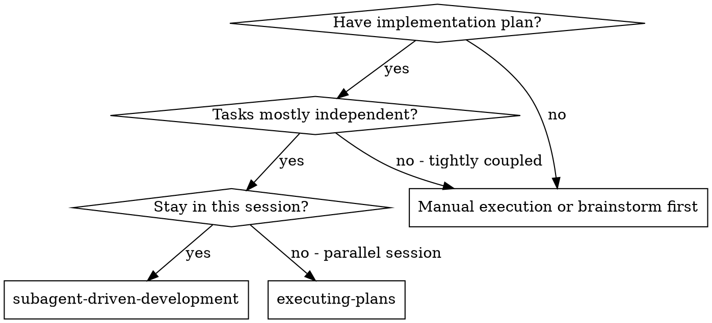
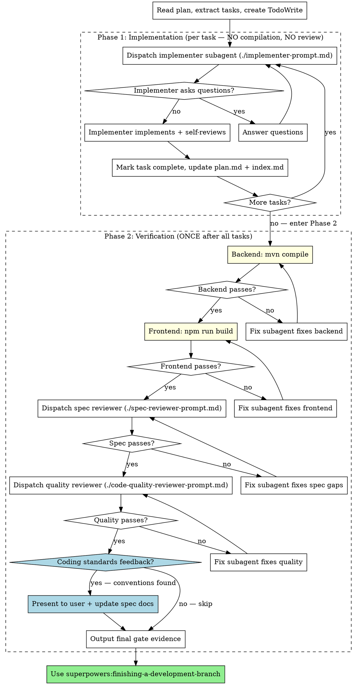

# Subagent-Driven Development

Execute plan by dispatching fresh subagent per task. Compilation and review are **deferred** to after all tasks complete (CLAUDE.md Rule 5/6).

**Core principle:** Fresh subagent per task (fast implementation) + deferred compilation (Rule 5) + deferred review (Rule 6) = high quality, fast iteration

## When to Use



**vs. Executing Plans (parallel session):**
- Same session (no context switch)
- Fresh subagent per task (no context pollution)
- Faster iteration (no human-in-loop between tasks)

## Controller Role Boundaries

CRITICAL: The controller (you) is an orchestrator, NOT an implementer.

### Controller MUST:
- Read plan, extract tasks, create TodoWrite
- Dispatch implementer subagent per task (via Agent tool)
- Answer subagent questions
- Update plan.md task status and index.md progress after each task
- After ALL tasks: run compilation, dispatch reviewers, output final gate evidence

### Controller MUST NOT:
- Write implementation code (that's the implementer subagent's job)
- Run compilation between tasks (CLAUDE.md Rule 5: defer until all tasks done)
- Dispatch reviewers between tasks (CLAUDE.md Rule 6: defer until compilation passes)
- Mark the feature as complete without passing all final gates

If you catch yourself writing implementation code instead of dispatching a subagent, STOP. You are violating the controller role boundary.

## The Process (Two Phases)



## Prompt Templates

- `./implementer-prompt.md` - Dispatch implementer subagent
- `./spec-reviewer-prompt.md` - Dispatch spec compliance reviewer subagent (Phase 2 only)
- `./code-quality-reviewer-prompt.md` - Dispatch code quality reviewer subagent (Phase 2 only)

---

## Phase 1: Implementation

### Per-task flow

For each task in the plan:

1. **Dispatch implementer subagent** with full task text + context (paste task, don't make subagent read plan file)
2. **Answer questions** if implementer asks (before implementation begins)
3. **Implementer completes**: implements code, self-reviews, reports back
4. **Mark task complete**: update plan.md task status, update index.md progress
5. **Move to next task** — do NOT compile or review

### What controller does NOT do in Phase 1

- ❌ Run `mvn compile` or `npm run build` (Rule 5: defer)
- ❌ Dispatch spec reviewer or code quality reviewer (Rule 6: defer)
- ❌ Output gate evidence blocks per task
- ❌ Wait for human review between tasks

### Status updates after each task

1. Update `<page>/plan.md` 任务状态 table: set status to `已完成`
2. Update `index.md` 执行进度 table: increment `已完成` count
3. On first task of a page: update `index.md` page `实施状态` to `进行中`
4. When all tasks of a page complete: update `index.md` page `实施状态` to `已完成`

---

## Phase 2: Verification (after ALL tasks complete)

**Entry condition:** All tasks in all page plans are marked `已完成`.

### Gate 1: Backend Compilation

- Controller runs `mvn compile` directly (no subagent)
- MUST see actual build output with exit 0
- Failure → dispatch fix subagent → re-compile → loop until pass

### Gate 2: Frontend Compilation

- Controller runs `npm run build` in frontend directory
- MUST see actual build output with exit 0
- Failure → dispatch fix subagent → re-build → loop until pass

### Gate 3: Spec Compliance

- MUST dispatch spec-reviewer subagent via Agent tool
- Reviewer covers the **entire implementation** (all tasks, all pages), not just one task
- Controller reviewing code itself does NOT satisfy this gate
- Use `./spec-reviewer-prompt.md` template
- Failure → dispatch fix subagent → re-dispatch spec reviewer → loop until pass

### Gate 4: Code Quality

- MUST dispatch code-quality-reviewer subagent via Agent tool
- Only after Gate 3 passes
- Reviewer covers the **entire implementation**
- Controller reviewing code itself does NOT satisfy this gate
- Use `./code-quality-reviewer-prompt.md` template
- Failure → dispatch fix subagent → re-dispatch quality reviewer → loop until pass

### Gate 5: Coding Standards Feedback

After Gate 4 passes, review all issues found during Gates 3-4 and check if any relate to coding conventions/patterns that should be captured in the coding standards docs.

**Controller does this directly (no subagent):**

1. Collect all issues found by spec reviewer (Gate 3) and code quality reviewer (Gate 4), including fixed ones
2. Filter for issues that represent **recurring patterns or conventions** (not one-off bugs), for example:
   - Naming inconsistencies (e.g., method should be `selectXxxList` not `getXxxList`)
   - Missing standard annotations or patterns
   - Code structure deviations from project conventions
   - Frontend/backend API calling pattern issues
3. If such issues exist, present them to the user:

```
### Coding Standards Feedback

The following issues from code review may indicate missing or unclear coding standards:

1. [Issue description] — suggested addition to [backend/frontend] coding standards
2. ...

Would you like to update the coding standards doc (`@spec/CODING_STANDARDS.md`) with these conventions?
```

4. Wait for user confirmation
5. If approved, update the relevant `coding-standards.md` file(s)
6. If no convention-related issues found, skip this gate silently

### Final Gate Evidence Block (Mandatory)

After all gates pass, output this block once:

```
### Final Gate Evidence
| Gate | Status | Evidence |
|------|--------|----------|
| Backend Compilation | ✅/❌ | command: `mvn compile`, exit code: [0/non-zero] |
| Frontend Compilation | ✅/❌ | command: `npm run build`, exit code: [0/non-zero] |
| Spec Review | ✅/❌ | subagent dispatched: yes, verdict: [pass/fail + issues] |
| Code Quality | ✅/❌ | subagent dispatched: yes, verdict: [pass/fail + issues] |
| Coding Standards Feedback | ✅/⏭️ | [N conventions proposed / no conventions to add] |

All gates ✅ → Implementation COMPLETE
Any gate ❌ → Fix and re-verify
```

---

## Example Workflow

```
You: I'm using Subagent-Driven Development to execute this plan.

[Read index.md → find execution order]
[Read first page plan → extract all tasks with full text]
[Create TodoWrite]

--- Phase 1: Implementation ---

Task 1: Database tables
[Dispatch implementer subagent with full task text]
Implementer: Implemented, self-review done.
[Update plan.md: Task 1 已完成, update index.md]

Task 2: Order list API (full vertical slice)
[Dispatch implementer subagent with full task text]
Implementer: "Should the date range be inclusive or exclusive?"
You: "Inclusive on both ends."
Implementer: Implemented, self-review done.
[Update plan.md: Task 2 已完成, update index.md]

... (continue for all tasks) ...

Task N: Frontend diff fixes
[Dispatch implementer subagent]
Implementer: Done.
[Update plan.md + index.md: all pages 已完成]

--- Phase 2: Verification ---

[mvn compile]
Backend compilation: ✅ BUILD SUCCESS

[npm run build]
Frontend compilation: ❌ TS error in orderLedger.vue
[Dispatch fix subagent → fix type error]
[npm run build again]
Frontend compilation: ✅ Build successful

[Dispatch spec reviewer for entire implementation]
Spec reviewer: ❌ Missing D3 (internalRelatedPartyName filter in delivery-record)
[Dispatch fix subagent → add missing filter]
[Dispatch spec reviewer again]
Spec reviewer: ✅ All requirements met

[Dispatch code quality reviewer]
Code reviewer: ✅ Approved. Minor: consider extracting shared date formatter.

[Coding Standards Feedback]
Review found: date formatter pattern should use `@JsonFormat(pattern = "yyyy-MM-dd")`
→ Present to user: "Should we add this to coding-standards.md?"
→ User approves → Update spec/backend/java/coding-standards.md

### Final Gate Evidence
| Gate | Status | Evidence |
|------|--------|----------|
| Backend Compilation | ✅ | command: `mvn compile`, exit code: 0 |
| Frontend Compilation | ✅ | command: `npm run build`, exit code: 0 (1 fix loop) |
| Spec Review | ✅ | subagent dispatched: yes, verdict: pass (1 fix loop) |
| Code Quality | ✅ | subagent dispatched: yes, verdict: pass |
| Coding Standards | ✅ | 1 convention added to backend spec |

All gates ✅ → Implementation COMPLETE

[Use superpowers:finishing-a-development-branch]
Done!
```

## Advantages

**vs. Per-task compilation + review (old approach):**
- N tasks: N subagents instead of 3N (implementer + spec + quality per task)
- 1 compilation instead of N compilations
- 1 spec review instead of N spec reviews
- ~3x faster for typical plans

**vs. Manual execution:**
- Fresh context per task (no confusion)
- Subagent can ask questions (before AND during work)

**vs. Executing Plans (parallel session):**
- Same session (no handoff)
- Continuous progress (no waiting for human between batches)

**Efficiency gains:**
- No file reading overhead (controller provides full text)
- Controller curates exactly what context is needed
- No compilation interrupts during coding flow
- Review covers entire implementation at once (better cross-task consistency checks)

**Quality gates (Phase 2):**
- Compilation gate: code must compile before any review
- Two-stage review: spec compliance, then code quality
- Spec compliance covers entire implementation (catches cross-task inconsistencies)
- Review loops ensure fixes actually work

## Red Flags

**Never:**
- **Write implementation code as controller** (dispatch a subagent)
- **Compile or review during Phase 1** (CLAUDE.md Rule 5/6: defer)
- Start implementation on main/master branch without explicit user consent
- Skip Phase 2 reviews (spec compliance AND code quality)
- Proceed with unfixed issues in Phase 2
- Dispatch multiple implementation subagents in parallel (conflicts)
- Make subagent read plan file (provide full text instead)
- Skip scene-setting context (subagent needs to understand where task fits)
- Ignore subagent questions (answer before letting them proceed)

**If reviewer finds issues in Phase 2:**
- Dispatch fix subagent with specific instructions
- Re-dispatch reviewer after fix
- Repeat until approved
- Don't skip the re-review
- Don't try to fix manually (context pollution)

### Known Failure Modes (from real incidents)

**Failure Mode 1: Controller becomes implementer**
The controller read existing code, fixed compilation errors, wrote new files, and declared all tasks complete. NO subagents were dispatched.

How to detect: If you're writing implementation code (not build commands), you've become the implementer. STOP and dispatch a subagent instead.

**Failure Mode 2: Per-task compilation/review (old pattern)**
The controller compiled and reviewed after every single task, making execution 3x slower than necessary.

How to detect: If you're running `mvn compile` or dispatching reviewers before all tasks are done, you're in the old pattern. STOP — continue to next task, defer to Phase 2.

**Failure Mode 3: No plan status updates**
The controller completed work but never updated `plan.md` task status table or `index.md` progress table.

How to detect: After completing a task, if you haven't written to plan.md and index.md, the task tracking is broken.

## Integration

**Required workflow skills:**
- **superpowers:using-git-worktrees** - REQUIRED: Set up isolated workspace before starting
- **superpowers:writing-plans** - Creates the plan this skill executes
- **superpowers:requesting-code-review** - Code review template for reviewer subagents
- **superpowers:finishing-a-development-branch** - Complete development after all tasks
- **superpowers:verification-before-completion** - REQUIRED: Evidence before any completion claims

**Subagents should use:**
- **superpowers:test-driven-development** - Subagents follow TDD for each task

**Alternative workflow:**
- **superpowers:executing-plans** - Use for parallel session instead of same-session execution
