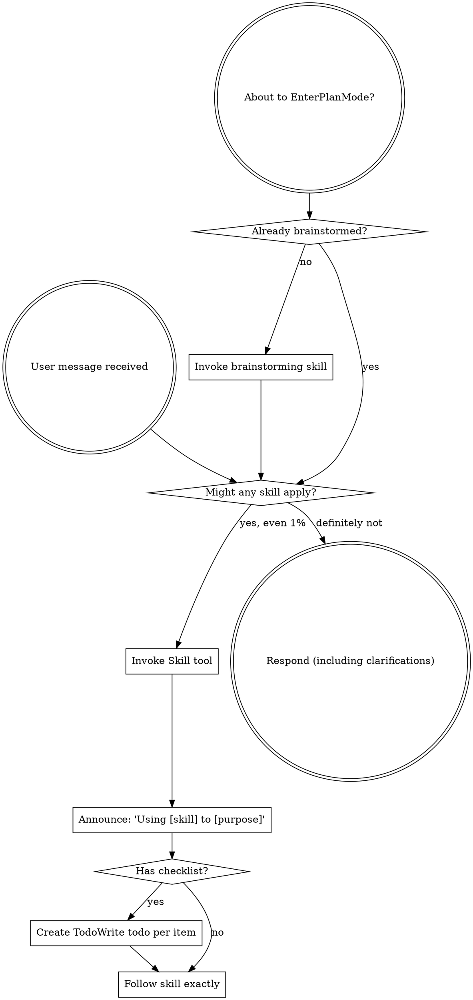

<EXTREMELY-IMPORTANT>
If you think there is even a 1% chance a skill might apply to what you are doing, you ABSOLUTELY MUST invoke the skill.

IF A SKILL APPLIES TO YOUR TASK, YOU DO NOT HAVE A CHOICE. YOU MUST USE IT.

This is not negotiable. This is not optional. You cannot rationalize your way out of this.
</EXTREMELY-IMPORTANT>

## How to Access Skills

**In Claude Code:** Use the `Skill` tool. When you invoke a skill, its content is loaded and presented to you—follow it directly. Never use the Read tool on skill files.

**In other environments:** Check your platform's documentation for how skills are loaded.

## Immediate Routing

**Do this before ANY tool call.**

If the user message contains any of these signals:

- `PRD` / `需求文档` / `requirement doc`
- `原型图` / `UI图` / `UI screenshot` / `prototype` / `截图`
- `差异分析` / `差异扫描` / `页面核对` / `对照现状` / `compare PRD with UI`
- explicit file paths such as `prd/...`, `docs/...-prd.md`, `ruoyi-ui/`, `src/`, or module directories that indicate “requirement path + implementation path”

Then your **first action** must be:

1. Invoke `Skill("superpowers:prd-diff-scan")`
2. Do **NOT** use `Read`, `Glob`, `Grep`, `Task`, or `brainstorming` first
3. Only after `*-diff.md` exists may you move to `brainstorming`

If the user also asks for design or implementation in the same message, this routing still wins.
Skipping this routing = workflow failure.

The user does **not** need to explicitly say "use prd-diff-scan". If they provide a requirement file path plus a project/module path, you must infer `prd-diff-scan` automatically.

If the user later asks for **详细设计**, keep the same workflow order: `prd-diff-scan` first when PRD/UI is present, then `brainstorming`, then save the detailed design by following the matching template under `spec/`.

# Using Skills

## The Rule

**Invoke relevant or requested skills BEFORE any response or action.** Even a 1% chance a skill might apply means that you should invoke the skill to check. If an invoked skill turns out to be wrong for the situation, you don't need to use it.

## Red Flags

These thoughts mean STOP—you're rationalizing:

| Thought | Reality |
|---------|---------|
| "This is just a simple question" | Questions are tasks. Check for skills. |
| "I need more context first" | Skill check comes BEFORE clarifying questions. |
| "Let me explore the codebase first" | Skills tell you HOW to explore. Check first. |
| "I can check git/files quickly" | Files lack conversation context. Check for skills. |
| "Let me gather information first" | Skills tell you HOW to gather information. |
| "This doesn't need a formal skill" | If a skill exists, use it. |
| "I remember this skill" | Skills evolve. Read current version. |
| "This doesn't count as a task" | Action = task. Check for skills. |
| "The skill is overkill" | Simple things become complex. Use it. |
| "I'll just do this one thing first" | Check BEFORE doing anything. |
| "This feels productive" | Undisciplined action wastes time. Skills prevent this. |
| "I know what that means" | Knowing the concept ≠ using the skill. Invoke it. |
| "I'll read the PRD or look for screenshots first" | Wrong. `prd-diff-scan` must be invoked before `Read`/`Glob`. |

## Skill Priority

When multiple skills could apply, use this order:

1. **Process skills first** (brainstorming, debugging, prd-diff-scan) - these determine HOW to approach the task
2. **Implementation skills second** (frontend-design, mcp-builder) - these guide execution

"Let's build X" + has PRD → prd-diff-scan first, then brainstorming.
"Let's build X" + no PRD → brainstorming directly.
"Fix this bug" → debugging first, then domain-specific skills.
"Analyze this PRD" → prd-diff-scan directly.
"Compare PRD with UI screenshot / prototype" → prd-diff-scan directly.
“对照 PRD 和 UI 图看看差异” → `prd-diff-scan` 直接优先。
“按原型图核对页面 / 做页面差异分析 / 差异扫描” → `prd-diff-scan` 直接优先。
“需求文档在 `prd/...`，UI 项目在 `ruoyi-ui/`” → 即使没点名 skill，也必须先走 `prd-diff-scan`。

“帮我出后端详细设计” → 在设计阶段使用 `spec/backend/java/detail-design-template.md` 并落盘。
“帮我出前端详细设计” → 在设计阶段使用 `spec/frontend/vue/detail-design-template.md` 并落盘。

If the user mentions **PRD / 原型图 / UI图 / 截图 / 差异分析 / 页面核对 / 对照现状**, bias strongly toward `prd-diff-scan` before any design or implementation skill.

## Skill Types

**Rigid** (TDD, debugging): Follow exactly. Don't adapt away discipline.

**Flexible** (patterns): Adapt principles to context.

The skill itself tells you which.

## User Instructions

Instructions say WHAT, not HOW. "Add X" or "Fix Y" doesn't mean skip workflows.
