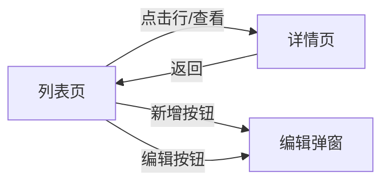
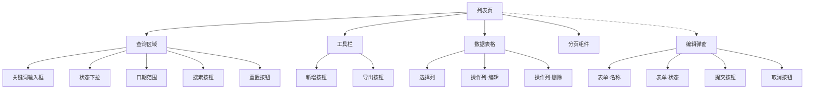
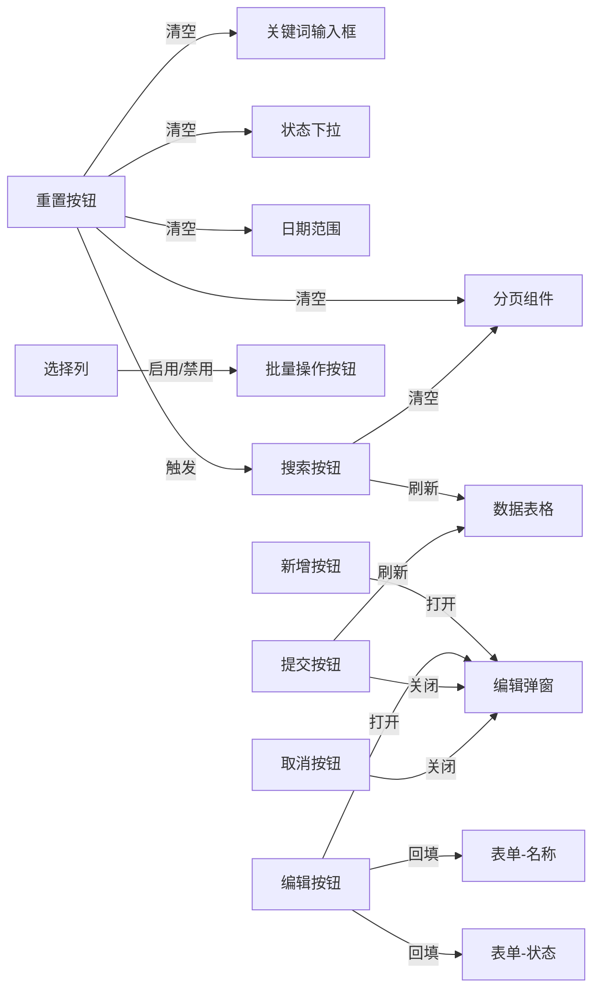

# 前端详细设计文档模板（若依 Vue 3）

```md
# {{功能名称}} — 前端详细设计

## 1. 功能概述

- **业务目标**：
- **入口路径**：
- **涉及角色 / 权限**：
- **不在本次范围**：

## 2. 受影响文件

| 类型 | 文件 | 说明 |
| --- | --- | --- |
| 页面 | `src/views/{{path}}/index.vue` | 主页面 |
| 接口 | `src/api/{{path}}.ts` | API 封装 |
| 类型 | `src/types/api/{{path}}.ts` | TS 类型 |
| 路由 | `src/router/index.ts` 或后端菜单 | 路由来源 |
| Store（可选） | `src/store/modules/{{name}}.ts` | 共享状态 |

## 3. 页面结构与依赖关系

### 3.1 页面模块

- 查询表单：
- 工具栏按钮：
- 列表区域：
- 弹窗 / 抽屉：
- 详情 / 子页面：

### 3.2 页面导航关系图

> 画出页面之间的跳转 / 嵌套 / 返回关系。
> **只画页面节点**，不要把"导出文件""下载"等动作画成节点；动作属于控件交互（3.4）。



### 3.3 页面-控件组合图

> 画出每个页面 / 模块包含哪些控件，用 `CXX[名称]` 编号。
> **弹窗 / 抽屉内的控件也要编号**，不要遗漏。
>
> **拆图规则**：
> - 多页面时，每个页面单独一张图（用 `#### 3.3.X 页面名` 子标题区分）
> - 单张图不超过 **20 个节点**，超过就按模块拆（如列表页一张、弹窗一张）
> - CXX 编号按页面独立，每个页面从 C01 开始，用子标题注明范围



### 3.4 控件交互关系图

> 画出控件之间的依赖 / 影响关系。边标签使用**标准类型**，保持不同页面的图风格统一：
>
> | 边类型 | 含义 | 示例 |
> | --- | --- | --- |
> | `清空` | 恢复控件到默认值 | 重置按钮 → 输入框 |
> | `刷新` | 重新加载数据 | 提交成功 → 表格 |
> | `触发` | 间接调用另一个控件的动作 | 重置 → 搜索 |
> | `禁用` / `启用` | 改变控件可用状态 | 勾选行 → 批量删除按钮 |
> | `显示` / `隐藏` | 改变控件可见性 | 切换类型 → 子表单区域 |
> | `打开` / `关闭` | 弹窗或抽屉的开关 | 新增按钮 → 编辑弹窗 |
> | `回填` | 用接口数据填充控件 | 编辑按钮 → 弹窗表单字段 |
>
> **拆图规则**：同 3.3，多页面时每个页面单独一张图，单张图不超过 **20 个节点**。



### 3.5 控件矩阵

> **3.5 是速查表**：一行一控件，快速定位"这个控件干什么、影响谁"。
> **Section 8 是详细流程**：含分支逻辑、异常处理、等价代码片段。
> 两者用相同的 CXX 编号对应。
>
> 每个控件除了写技术字段，**必须写清「业务说明」**——
> 用户为什么需要这个控件、解决什么业务问题，不能只写"更新某字段"。
>
> **多页面时**：3.1 中列出的每个页面都必须有对应的控件矩阵子表（用 `#### 页面名 控件` 子标题区分）。
> 不得只写第一个页面而省略其余页面。

#### 列表页控件

| 控件 ID | 控件名称 | 类型 | 业务说明 | 触发事件 | 效果描述 | 影响的控件 | 调用接口 |
| --- | --- | --- | --- | --- | --- | --- | --- |
| C01 | 关键词输入框 | el-input | 用户按关键词模糊搜索目标记录 | input | 更新 `queryParams.keyword` | — | — |
| C02 | 状态下拉 | el-select | 按业务状态筛选，快速定位特定阶段的数据 | change | 更新 `queryParams.status` | — | — |
| C03 | 日期范围 | el-date-picker | 按时间段缩小查询范围 | change | 更新 `queryParams.beginTime/endTime` | — | — |
| C04 | 搜索按钮 | el-button | 执行当前筛选条件的查询 | click | 页码重置为 1，调用列表接口 | 数据表格、分页组件 | `GET /list` |
| C05 | 重置按钮 | el-button | 清除所有筛选条件，回到默认的完整列表 | click | C01-C03 恢复默认值，页码重置，触发查询 | C01, C02, C03, 分页组件, 数据表格 | `GET /list` |
| C06 | 新增按钮 | el-button | 创建一条新的业务记录 | click | 打开编辑弹窗（空表单） | 编辑弹窗 | — |
| C07 | 导出按钮 | el-button | 将当前筛选结果导出为 Excel 供线下使用 | click | 调导出接口，下载文件 | — | `POST /export` |
| C08 | 选择列 | el-checkbox | 批量选中记录，配合批量操作（如批量删除） | change | 更新 `ids` / `single` / `multiple` 状态 | 工具栏按钮禁用状态 | — |
| C09 | 操作列-编辑 | el-button | 修改已有记录的信息 | click | 调详情接口回填表单，打开编辑弹窗 | 编辑弹窗 | `GET /{id}` |
| C10 | 操作列-删除 | el-button | 删除不再需要的记录 | click | 弹出确认框，确认后调删除接口，刷新列表 | 数据表格 | `DELETE /{id}` |

#### 弹窗 / 抽屉控件

| 控件 ID | 控件名称 | 类型 | 业务说明 | 触发事件 | 效果描述 | 影响的控件 | 调用接口 |
| --- | --- | --- | --- | --- | --- | --- | --- |
| C11 | 表单-名称 | el-input | 记录的核心标识信息，必填 | blur | 触发必填校验 | — | — |
| C12 | 表单-状态 | el-select | 设置记录的业务状态 | change | 更新 `form.status` | — | — |
| C13 | 提交按钮 | el-button | 保存当前编辑的记录到后端 | click | 表单校验 → 有 id 调 PUT，无 id 调 POST → 成功后关闭弹窗并刷新列表 | 编辑弹窗、数据表格 | `POST / PUT` |
| C14 | 取消按钮 | el-button | 放弃当前编辑，不保存任何修改 | click | 关闭弹窗，不刷新列表 | 编辑弹窗 | — |

#### 控件状态条件

> 权限、显隐、禁用、默认值单独列表，避免主表过宽。

| 控件 ID | 权限字符串 | 显示条件 | 禁用条件 | 默认值 |
| --- | --- | --- | --- | --- |
| C06 | `{{module}}:{{resource}}:add` | 始终显示 | — | — |
| C07 | `{{module}}:{{resource}}:export` | 始终显示 | — | — |
| C09 | `{{module}}:{{resource}}:edit` | 始终显示 | — | — |
| C10 | `{{module}}:{{resource}}:remove` | 始终显示 | 未勾选行时禁用（`single` 为 true） | — |
| C01 | — | 始终显示 | — | `''`（空字符串） |
| C02 | — | 始终显示 | — | `''`（全部） |
| C03 | — | 始终显示 | — | `[]`（不限时间） |
| C13 | — | 弹窗打开时 | 提交请求中（防重复提交） | — |

### 3.6 状态定义

| 状态 | 类型 | 说明 |
| --- | --- | --- |
| `loading` | `ref<boolean>` | 列表加载状态 |
| `showSearch` | `ref<boolean>` | 查询区域显隐 |
| `total` | `ref<number>` | 总条数 |
| `queryParams` | `reactive` | 查询参数 |
| `form` | `reactive/ref` | 表单数据 |

## 4. 路由、菜单与权限

- **页面路由**：
- **后端菜单 component**：
- **按钮权限**：
- **隐藏详情页是否需要 `dynamicRoutes`**：

## 5. 接口设计

| 场景 | 方法 | 路径 | 返回类型 |
| --- | --- | --- | --- |
| 列表 | GET | `/.../list` | `TableDataInfo<T>` |
| 明细 | GET | `/.../{id}` | `AjaxResult<T>` |
| 新增 | POST | `/...` | `AjaxResult` |
| 修改 | PUT | `/...` | `AjaxResult` |
| 删除 | DELETE | `/.../{id}` | `AjaxResult` |

## 6. 类型设计

- 实体类型：
- 查询参数类型：
- 表单类型：
- 响应类型：

## 7. 字典与展示规则

- 需要哪些字典：
- 哪些字段用 `DictTag` 展示：
- 状态值映射：

## 8. 交互规则 — 按控件

> **Section 8 是详细流程**，针对每个控件写清完整交互剧本：
> 用户操作 → 前端行为 → 后端调用 → 成功/失败/空态处理。
> 与 3.5 的区别：3.5 是速查表（一眼看到每个控件干什么），Section 8 是含分支、异常、边界情况的完整描述。
> 控件 ID 与 3.5 控件矩阵保持一致。
>
> 每个控件先写一句**业务场景**（用户为什么要做这个操作），再写技术流程。

### 8.0 页面初始化

> 页面首次加载 / 从其他页面返回时的自动行为，不需要用户操作就会发生。

- **业务场景**：用户进入页面后，应立刻看到数据列表和可用的筛选选项
- 页面挂载（`onMounted`）→ 加载字典数据（`proxy.getDict(...)`）
- 页面挂载 → 初始化 `queryParams` 各字段的默认值
- 页面挂载 → 检查 URL 参数 / 路由 query，有则回填到 `queryParams`
- 页面挂载 → 自动调用 `getList()` 加载首页数据
- 接口失败 → `ElMessage.error` 提示，表格显示空态

### 8.1 查询区域

#### C04 搜索按钮

- **业务场景**：用户设好筛选条件后，点击搜索获取匹配结果
- 点击 → 组装 `queryParams` → 页码重置为 1 → 调 `GET /list`
- 成功：刷新表格数据、更新 `total`
- 失败：`ElMessage.error` 提示
- 空数据：表格展示空态提示（如"暂无数据"），查询区域和新增按钮保持可用

#### C05 重置按钮

- **业务场景**：用户想清除所有筛选条件，回到初始的完整列表
- 点击 → C01 清空 → C02 恢复"全部" → C03 清空 → 页码重置为 1 → 触发搜索
- 等价于：`formRef.resetFields()` + `handleQuery()`
- 重置后各控件的值见 3.5「控件状态条件」表的默认值列

### 8.2 工具栏

#### C06 新增按钮

- **业务场景**：用户要创建一条新的业务记录
- 点击 → 重置 `form` 为空对象 → `open = true` → 弹窗标题 = "新增"

#### C07 导出按钮

- **业务场景**：用户需要把当前筛选结果导出为 Excel 供线下查看或汇报
- 点击 → 使用当前 `queryParams` 调导出接口 → 下载文件
- 失败：`ElMessage.error` 提示

### 8.3 表格操作列

#### C09 操作列-编辑

- **业务场景**：用户要修改某条已有记录的信息
- 点击 → 调 `GET /{id}` 获取详情 → 回填 `form`（对应 C11、C12 等表单控件）→ `open = true` → 弹窗标题 = "修改"
- 详情接口失败 → `ElMessage.error` 提示，弹窗不打开

#### C10 操作列-删除

- **业务场景**：用户要删除不再需要的记录
- 点击 → `ElMessageBox.confirm` 确认（提示文案包含记录标识）
- 确认 → 调 `DELETE /{id}` → 删除成功 → `ElMessage.success` → 刷新列表
- 取消 → 无操作
- 删除接口失败 → `ElMessage.error` 提示，列表不变

### 8.4 弹窗

#### C13 提交按钮

- **业务场景**：用户填完表单后保存记录
- 点击 → 表单校验（`formRef.validate()`）
- 校验不通过 → 高亮错误字段，不发请求
- 校验通过 → 判断有无 `form.id`：有调 `PUT`，无调 `POST`
- 请求中 → 按钮禁用（防重复提交）
- 成功：`ElMessage.success` → 关闭弹窗 → 刷新列表
- 失败：`ElMessage.error` 提示 → 弹窗保持打开，表单数据保留，用户可修改后重试

#### C14 取消按钮

- **业务场景**：用户放弃当前编辑，不保存任何修改
- 点击 → 关闭弹窗 → 不刷新列表

### 8.5 空态与异常

> 汇总页面在无数据或接口异常时的展示行为。

| 场景 | 展示 | 可操作控件 |
| --- | --- | --- |
| 列表为空（正常查询无结果） | 表格显示"暂无数据" | 查询区域、新增按钮正常可用 |
| 列表接口失败 | `ElMessage.error`，表格保持上次数据或空态 | 可重试搜索 |
| 弹窗详情接口失败 | `ElMessage.error`，弹窗不打开 | 列表操作正常 |
| 弹窗提交失败 | `ElMessage.error`，弹窗保持打开，表单数据保留 | 可修改后重新提交 |
| 导出失败 | `ElMessage.error` | 可重试导出 |
| 字典加载失败 | 下拉框显示原始值（无翻译） | 其他操作正常 |

## 9. 验证方式

- 手工验证路径：
- 权限验证：
- 构建验证：
- 回归点：

## 10. 自检清单

> 保存文档前，逐项检查并标记 ✅ / ❌。全部 ✅ 才可保存，任一 ❌ 必须修正后重新检查。

| # | 检查项 | ✅/❌ |
|---|--------|------|
| 1 | 3.1 中列出的**所有页面**在 3.3、3.4、3.5、Section 8 中都有对应内容，无遗漏 | |
| 2 | 3.2 页面导航图**只含页面节点**，不含"导出文件""下载"等动作节点 | |
| 3 | 3.3 每张组合图**不超过 20 个节点**；超过已按模块拆分 | |
| 4 | 3.3 **弹窗 / 抽屉内的控件**已编号，未遗漏 | |
| 5 | 3.4 边标签全部使用**标准类型**（清空/刷新/触发/禁用·启用/显示·隐藏/打开·关闭/回填） | |
| 6 | 3.5 控件矩阵每行都有**业务说明**（不是只写"更新某字段"） | |
| 7 | 3.5 附有**控件状态条件**子表（权限 / 显隐 / 禁用 / 默认值） | |
| 8 | Section 5 接口清单覆盖了 3.5 中所有「调用接口」列出现的接口 | |
| 9 | Section 6 类型设计包含**实体、查询参数、表单**三种类型（至少） | |
| 10 | 8.0 页面初始化已写（字典加载、默认值、自动查询） | |
| 11 | 8.1-8.4 每个交互控件 CXX 都有对应描述，先写**业务场景**再写技术流程 | |
| 12 | 8.5 空态与异常表已覆盖：空列表、接口失败、弹窗失败、导出失败、字典失败 | |
| 13 | **API 文件覆盖**：3.5 控件矩阵中出现的每个不同 API 基路径，在 Section 2 受影响文件中都有对应的 API 文件（如 `/order/xxx` 和 `/inventory/xxx` 是两个基路径，需要两个 API 文件） | |
| 14 | **类型覆盖**：Section 5 接口清单中每个不同的返回实体类型，在 Section 6 类型设计中都有定义（如接口返回 `Order`、`DeliveryRecord`、`ConsignmentInventory` 三种类型，Section 6 必须都有） | |
```
